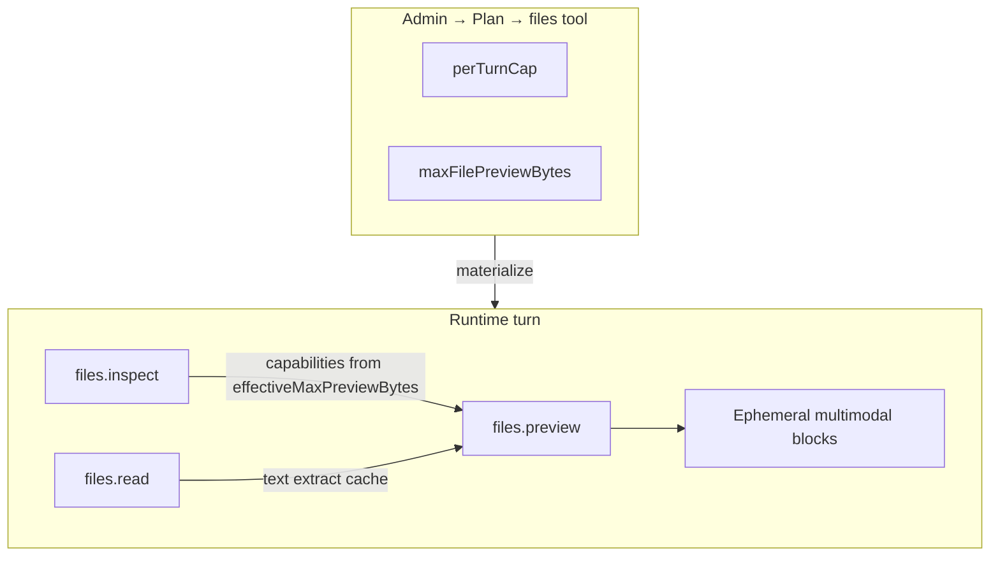

# ADR-116: Runtime file re-view — inspect, read, preview

**Status:** Accepted  
**Date:** 2026-06-14  
**Relates to:** [ADR-074](074-humanity-and-cost-polish-program.md) (`files` `perTurnCap`, `ToolBudgetPolicy`), [ADR-081](081-unified-user-files-architecture.md) (canonical `AssistantFile` / alias-first Files), [ADR-097](097-autonomous-document-tool-and-async-rendering.md) (shared PDF/DOCX extraction; no raw binary in tool results), [ADR-112](112-context-memory-and-tool-surface-quality-program.md) (Working Files sticky aliases), [ADR-100](100-project-chat-mode-and-b2b-analysis-profile.md) (project file auto-extract — separate seam), [API-BOUNDARY.md](../API-BOUNDARY.md), [DATA-MODEL.md](../DATA-MODEL.md), [TEST-PLAN.md](../TEST-PLAN.md), [AGENTS.md](../../AGENTS.md)

## Context

Users expect the assistant to **return to an earlier file** in the same chat — reread a PDF, look at a product photo again, compare with a brand reference — without re-uploading.

Founder intent (canonical):

1. **Platform capability**, not a marketing-only hook. Any skill, mode, or tool path may need on-demand file re-access.
2. **Three explicit modes** — metadata inspect, text read, visual preview — not one overloaded `files.read`.
3. **Alias-first** (`file #N`, `image #N`) per ADR-081/112; raw `fileRef` stays internal.
4. **No regression** to raw binary in tool-result JSON (2026-05-17 `%PDF` token blow-up).
5. **No history vision re-hydration** — re-view is **on-demand**, not “resend every attachment every turn”.
6. **PersAI-native only** — reuse `AssistantFile`, internal extract API, object storage download, existing resize/vision helpers.
7. **Economical** — frequency and preview size are **plan-owned on the `files` tool**; runtime keeps **code defaults only** plus a **platform absolute ceiling**. No ADR-116-specific per-turn counters.

### Existing code truth (baseline audit 2026-06-14)

| Area                            | Today                                                                                                                                                            | Gap                                                                                                    |
| ------------------------------- | ---------------------------------------------------------------------------------------------------------------------------------------------------------------- | ------------------------------------------------------------------------------------------------------ |
| File discovery                  | Working Files (`## Working Files`), sticky aliases, `files.search` / `list` / `get`                                                                              | —                                                                                                      |
| `files.get`                     | Metadata only (`action: "fetched"`)                                                                                                                              | No `capabilities[]`; tool copy says “inspect” but no `inspect` action                                  |
| `files.read` text               | `txt/md/csv/json` via sandbox UTF-8; PDF/DOCX via `POST /api/v1/internal/runtime/files/extract` → `DocumentExtractionService` (local → Mistral OCR / LlamaParse) | Images/binaries rejected with `binary_file_read_unsupported`; content capped at 16k chars in sanitizer |
| Extraction cache                | `assistant_files.metadata` internal runtime extraction cache                                                                                                     | —                                                                                                      |
| Current-turn vision             | `turn-context-hydration.service.ts` injects image/PDF when `allowDirectAttachmentInput=true` (current inbound user message only)                                 | Uses **hardcoded** `MAX_DIRECT_PROVIDER_ATTACHMENT_BYTES` (8 MB); historical messages: text only       |
| `image_edit` / `video_generate` | Load bytes by alias/`objectKey` for provider workers                                                                                                             | Model does not “see” image for Q&A — only worker transport                                             |
| Tool loop                       | `sanitize-tool-result-for-model.ts` → `ProviderGatewayToolResult.content` is **JSON string only**                                                                | **Cannot** embed base64 images in tool results                                                         |
| Per-turn `files` budget         | `tool-budget-policy.ts` default `files: 10`; plan `toolActivations[].perTurnCap` → `RuntimeToolPolicy.perTurnCap`                                                | `preview` must share this cap — no separate preview counter                                            |
| Plan `files` tool settings      | `perTurnCap`, `dailyCallLimit`, activation                                                                                                                       | **No** `maxFilePreviewBytes` (or equivalent) on `files` activation                                     |
| Media completion vision         | `media-job-completion-vision-hydration.ts`                                                                                                                       | Pattern for preview injection; post-job only                                                           |
| Project mode                    | `gatherProjectFileItems` auto-extracts chat PDFs into retrieval                                                                                                  | Text-only; not on-demand preview                                                                       |
| Terminology                     | `native-tool-projection.ts` / `runtime-tool-policy.ts` say “inspect”                                                                                             | Drift: enum has `get`, not `inspect`                                                                   |

**Root gap:** durable file identity and **text** re-read exist; **on-demand visual re-view of historical files** does not. Preview byte limits are **hardcoded in hydration**, not plan-tunable.

## Non-goals

- Re-hydrating full chat history with images/PDFs every turn.
- Base64 or binary content inside tool-result JSON.
- PDF page rasterization (poppler/pdfium) in v1 — visual PDF re-view uses **native PDF content blocks** when under effective byte limit.
- New parallel file registry, filesystem session state, or OpenClaw shims.
- Raising the global 16k `files.read` text cap without an explicit truncated contract in the payload.
- XLSX/PPTX/ODT expansion unless `DocumentExtractionService` already supports the MIME in the active path (verify in slice, do not assume).
- Skill scenarios / scenario run state (separate future ADR).
- User-facing Files UI changes beyond Admin → Plans `files` tool fields (runtime/model contract is the primary surface).
- Auto-preview without a structured `files.preview` tool call (no keyword/heuristic triggers).
- A second per-turn quota layer for preview (`previewPerTurnCap`, “max N previews per turn” hardcodes).
- Runtime-only product byte limits that ignore plan `files` tool policy (hardcode **defaults** only).

## Decision

### D1 — Three model-facing file access modes (one `files` tool, three actions)

Extend `PERSAI_RUNTIME_FILES_TOOL_ACTIONS` with **`inspect`** and **`preview`**. Keep **`read`** as the text path.

| Action        | Purpose                                                      | Model receives                                                                                                                                           |
| ------------- | ------------------------------------------------------------ | -------------------------------------------------------------------------------------------------------------------------------------------------------- |
| **`inspect`** | Resolve alias/path/query; return metadata + **capabilities** | `mimeType`, `sizeBytes`, aliases, `semanticSummaryHint`, `capabilities: ("text" \| "visual")[]`, `effectiveMaxPreviewBytes`, optional `extractionCached` |
| **`read`**    | Text content                                                 | Extracted or sandbox text; `truncated`, `charCount`, `quality` when from document extraction                                                             |
| **`preview`** | Visual re-view                                               | Tool result: acknowledgment only; **pixels/PDF bytes injected separately** (D2)                                                                          |

**`inspect` vs `get`:** v1 adds `inspect` as the canonical metadata action. `get` remains a **compatibility alias** delegating to the same implementation; projection and policy copy teach **`inspect` only**.

**Capability rules (deterministic):**

| MIME / kind                | `text`       | `visual`                                                                    |
| -------------------------- | ------------ | --------------------------------------------------------------------------- |
| `text/*`, json, csv, md, … | yes          | no                                                                          |
| `application/pdf`          | yes (`read`) | yes (`preview` native PDF) **if** `sizeBytes ≤ effectiveMaxPreviewBytes`    |
| docx                       | yes (`read`) | no (text extraction only; no native docx preview in v1)                     |
| `image/*`                  | no           | yes (`preview` resized image) **if** `sizeBytes ≤ effectiveMaxPreviewBytes` |
| audio/video/other binary   | no           | no                                                                          |

### D2 — Preview injection seam (not tool-result multimodal)

Tool results stay **string JSON only** (ADR-097 invariant).

When `files.preview` succeeds:

1. Runtime resolves **effectiveMaxPreviewBytes** (D3) and rejects oversize files with `preview_size_limit` before download when `sizeBytes` is known (or after download if needed).
2. Runtime downloads canonical bytes via existing registry / `mediaObjectStorage`.
3. Runtime builds multimodal blocks (image resize + native PDF block) using shared preview helper.
4. Blocks sit on turn-local **`pendingFilePreviewBlocks`** for the current tool-loop iteration only.
5. Next main provider call prepends ephemeral **user** multimodal content (media-completion vision pattern), then clears consumed blocks.
6. Tool-result JSON: `{ action: "previewed", alias, mimeType, visualKind, instruction }` — **never** base64.

**Per-turn frequency:** each `files` action (`inspect`, `read`, `preview`, `search`, …) consumes **one unit** of existing `RuntimeToolPolicy.perTurnCap` / `ToolBudgetPolicy`. Exhaustion → **`tool_budget_exhausted`**. No ADR-116-specific counter.

**API shape:** one `files.preview` call → one resolved alias → one file (not a plan limit; structured request shape).

### D3 — Plan-owned limits + code defaults + platform ceiling

**Product truth lives on Admin → Plans → `files` tool activation**, materialized onto the `files` `RuntimeToolPolicy` in the runtime bundle.

| Field                  | Owner                                        | Purpose                                                  |
| ---------------------- | -------------------------------------------- | -------------------------------------------------------- |
| `perTurnCap`           | Plan `toolActivations[]` (existing)          | Max `files` tool calls per turn                          |
| `maxFilePreviewBytes`  | Plan `toolActivations[]` (**new**)           | Max bytes for one visual preview (image or native PDF)   |
| `maxFilePreviewEdgePx` | Plan `toolActivations[]` (**new**, optional) | Max image edge for preview resize; `null` → code default |

**Code defaults only** (used when plan field is `null` / missing on legacy rows):

| Constant                           | Default            | Location                                            |
| ---------------------------------- | ------------------ | --------------------------------------------------- |
| `DEFAULT_MAX_FILE_PREVIEW_BYTES`   | `8_388_608` (8 MB) | `packages/config` or shared runtime constant        |
| `DEFAULT_MAX_FILE_PREVIEW_EDGE_PX` | `2048`             | same                                                |
| `TOOL_HARD_CAP_PER_TURN.files`     | `10`               | `tool-budget-policy.ts` (existing ADR-074 fallback) |

**Platform absolute ceiling** (plans may only go **lower**, never higher):

| Field                         | Owner                                                | Purpose                            |
| ----------------------------- | ---------------------------------------------------- | ---------------------------------- |
| `filePreviewAbsoluteMaxBytes` | `packages/config` (v1); optional Admin Runtime later | Hard max for materialization clamp |

**Effective runtime value:**

```text
effectiveMaxPreviewBytes =
  min(
    plan.maxFilePreviewBytes ?? DEFAULT_MAX_FILE_PREVIEW_BYTES,
    platform.filePreviewAbsoluteMaxBytes
  )
```

Same `effectiveMaxPreviewBytes` (and edge px) must drive:

- `files.preview`
- `files.inspect` `capabilities` / `visual` eligibility
- **current-turn** direct attachment hydration in `turn-context-hydration.service.ts` (replace hardcoded `MAX_DIRECT_PROVIDER_ATTACHMENT_BYTES` for images/PDF with bundle-resolved effective limit)

**Materialization:** `materialize-assistant-published-version.service.ts` copies plan `files` activation fields onto `RuntimeToolPolicy` for `toolCode: "files"` (same pattern as `perTurnCap`, `talkingVideoEnabled` on `video_generate`).

**Admin UI:** `apps/web/app/admin/plans/page.tsx` — add fields under the existing `files` tool activation row (`perTurnCap` sibling). No new admin page.

### D4 — Read path (harden existing, no second extractor)

`files.read` for PDF/DOCX unchanged in substance: internal extract API → `DocumentExtractionService` → cache on `assistant_files.metadata`.

**v1 improvements:** model-visible `extractionQuality`, `truncated`, `charCount`, `note`; sanitizer sets `truncated: true` when clipping to 16k.

**Images:** `read` unsupported; use `preview`.

### D5 — Working Files unchanged

`## Working Files` remains a metadata catalog only (aliases, markers, ≤120 char `semanticSummaryHint`).

### D6 — Relationship to other seams

| Seam                             | Relationship                                                  |
| -------------------------------- | ------------------------------------------------------------- |
| Current-turn attachments         | Same **effective** preview byte limit as `files.preview` (D3) |
| `image_edit` / `video_generate`  | Unchanged — worker byte load; not Q&A vision                  |
| Project `gatherProjectFileItems` | Unchanged — text extract for retrieval                        |
| Knowledge inspect API            | Unrelated — indexing debug                                    |
| User download API                | Unchanged                                                     |

### D7 — Observability

Log `file_preview` at info: `assistantId`, internal `fileRef`, `mimeType`, `bytes`, `effectiveMaxPreviewBytes`, `capSource` (`plan` | `default` | `clamped`). No base64 in logs.

### D8 — Economics (founder constraint)

1. **On-demand only** — `files.preview` must be called; no auto re-hydrate of history.
2. **One frequency budget** — all `files` actions share `perTurnCap`.
3. **One byte budget surface** — plan `maxFilePreviewBytes` (+ platform ceiling); runtime does not invent product limits.
4. **Cheap catalog, expensive look** — `inspect` / Working Files are metadata; bytes only on `preview` (and current-turn attachment when user uploads).
5. **Reuse extraction cache** — do not re-OCR on every `read`.

## Consequences

### Positive

- Discover → inspect → read or preview; one Files story.
- Plan operators tune economy without deploy; code keeps defaults + safety ceiling only.
- Unified byte limit for upload vision and historical preview.

### Negative

- Tool-loop ephemeral multimodal injection adds complexity.
- PDF visual quality depends on provider native PDF support.
- Materialization + Admin Plans UI touch required in v1 (not runtime-only).

## Alternatives considered

| Alternative                           | Verdict                                                    |
| ------------------------------------- | ---------------------------------------------------------- |
| Hardcoded 8 MB only in runtime        | Rejected — plan cannot tune; duplicates hydration constant |
| Separate `previewPerTurnCap`          | Rejected — `perTurnCap` already exists                     |
| Put images in tool-result JSON        | Rejected — ADR-097 regression risk                         |
| Re-hydrate all historical attachments | Rejected                                                   |
| Separate `file_preview` tool          | Rejected — ADR-081 single `files` surface                  |
| PDF page rasterization in v1          | Rejected                                                   |
| Platform ceiling only, no plan field  | Rejected — founder wants plan/files-tool settings          |

## Agent execution program

**Rules for agents:**

1. One session = **one slice** unless explicitly coupled.
2. Clean git tree; baseline SHA in `docs/SESSION-HANDOFF.md`.
3. Update `API-BOUNDARY.md`, `DATA-MODEL.md`, `TEST-PLAN.md`, `CHANGELOG.md`, slice row when behavior lands.
4. AGENTS.md verification gate before claiming clean.
5. No skill scenarios or PDF rasterizer in this program.

| Slice     | Title                                         | Deploy                    | Depends                                     |
| --------- | --------------------------------------------- | ------------------------- | ------------------------------------------- | ----- |
| **116.0** | Contract + plan `files` limits + inspect      | **DONE** (2026-06-14)     | DEPLOY REQUIRED (api, runtime, web)         | —     |
| **116.1** | Read hardening                                | **DONE** (2026-06-14)     | DEPLOY REQUIRED (runtime, api)              | 116.0 |
| **116.2** | Preview + injection + unified hydration limit | **DONE** (2026-06-14)     | DEPLOY REQUIRED (runtime, provider-gateway) | 116.0 |
| **116.3** | Tests, docs, live acceptance                  | DEPLOY REQUIRED (runtime) | 116.1, 116.2                                |

**Minimum PROD path:** `116.0 → 116.2 → 116.3`.

---

### Slice 116.0 — Contract + plan limits + inspect

**Purpose:** Add `inspect` / `preview` to runtime contract; plan fields `maxFilePreviewBytes` (+ optional `maxFilePreviewEdgePx`) on `files` tool activation; materialize to `RuntimeToolPolicy`; platform clamp helper; implement `inspect`; fix projection copy; `get` delegates to `inspect`.

**Likely files/modules:**

- `packages/runtime-contract/src/index.ts` — actions, `RuntimeToolPolicy` fields for `files`
- `packages/config` — `DEFAULT_MAX_FILE_PREVIEW_*`, `filePreviewAbsoluteMaxBytes`
- `apps/api/prisma/schema.prisma` — nullable columns on `plan_catalog_tool_activation` (or documented JSON extension if already used for tool hints — prefer explicit columns)
- `apps/api/.../manage-admin-plans.service.ts` — parse/validate plan fields
- `apps/api/.../materialize-assistant-published-version.service.ts` — forward onto `files` policy
- `apps/web/app/admin/plans/page.tsx` (+ tests) — `files` tool row UI
- `apps/runtime/.../runtime-files-tool.service.ts` — `executeInspectAction`
- `apps/runtime/.../native-tool-projection.ts`, `runtime-tool-policy.ts` — copy + schema
- `packages/contracts/openapi.yaml` — if admin plan contract exposes tool activation fields

**Acceptance:**

- Plan save/load round-trips `maxFilePreviewBytes` for `files` activation.
- Materialized bundle `files` policy carries effective values; legacy plans get code defaults.
- `inspect` returns `capabilities` with `visual` only when `sizeBytes ≤ effectiveMaxPreviewBytes`.
- `get` ≡ `inspect` shape.
- No `preview` execution yet.

---

### Slice 116.1 — Read hardening

**Purpose:** Enrich `files.read` document payloads; explicit `truncated` when sanitizer clips.

**Likely files/modules:**

- `runtime-files-tool.service.ts`, `persai-internal-api.client.service.ts`, `sanitize-tool-result-for-model.ts`
- `runtime-files-tool.service.test.ts`, `sanitize-tool-result-for-model.test.ts`

**Acceptance:**

- PDF/DOCX read returns quality + truncated metadata; cache hit skips OCR.
- No `%PDF-` in tool-result string.

---

### Slice 116.2 — Preview + injection + unified limit

**Purpose:** `files.preview` for `image/*` and native PDF; ephemeral multimodal injection; `turn-context-hydration` uses bundle `effectiveMaxPreviewBytes` instead of hardcoded 8 MB.

**Likely files/modules:**

- `runtime-file-preview-hydration.ts` (new helper)
- `runtime-files-tool.service.ts` — `executePreviewAction`
- `turn-execution.service.ts` — `pendingFilePreviewBlocks`, `ToolBudgetPolicy` for `preview`
- `turn-context-hydration.service.ts` — read effective limit from bundle
- `turn-execution.service.test.ts`, `runtime-files-tool.service.test.ts`

**Acceptance:**

- Turn 1 image, turn 3 `files.preview` → model answers from vision block; no base64 in tool JSON.
- PDF under effective limit → native PDF preview; over limit → `preview_size_limit`; `read` still works.
- Current-turn upload uses **same** effective byte limit as preview.
- `perTurnCap` exhaustion → `tool_budget_exhausted`.

---

### Slice 116.3 — Tests, docs, live acceptance

**Purpose:** Repo truth + smoke.

**Likely files/modules:**

- `docs/API-BOUNDARY.md`, `docs/DATA-MODEL.md`, `docs/TEST-PLAN.md`, `CHANGELOG.md`, `SESSION-HANDOFF.md`

**Live acceptance:**

1. Image re-view across turns via `preview`.
2. PDF text via `read`.
3. Lower plan `maxFilePreviewBytes` → large file loses `visual` on `inspect` and `preview_size_limit` on preview; text read still works.
4. Regression: no `%PDF-` in `files.read` tool result.

---

## As-is → target flow (reference)


