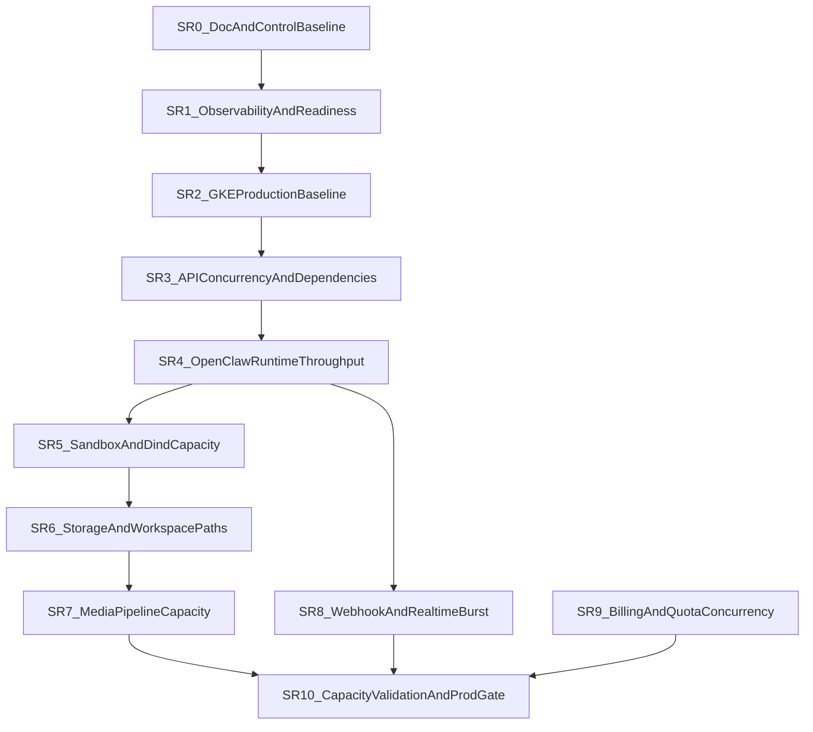

# SCALING-READINESS-PLAN

## Status
Working execution plan aligned with `ADR-070`.

## Resume Protocol
If a later Cursor session needs to recover context quickly, use this order:

1. `docs/SCALING-READINESS-PLAN.md`
2. `docs/ROADMAP.md`
3. `docs/SESSION-HANDOFF.md`
4. `docs/ADR/070-scaling-readiness-program-and-clean-delivery-discipline.md`
5. relevant supporting ADRs for the active slice

This file is the central execution plan for the scaling-readiness program.

## Purpose
Define one clean execution line for taking PersAI toward production-readiness for `1000–5000` online users without:

- losing context between Cursor-agent sessions
- mixing unrelated risk domains in one refactor
- deepening temporary compatibility paths
- stacking risky deploys without observation windows

## Program Principles
- PersAI remains the control plane; OpenClaw remains the execution plane.
- One session = one slice or one explicitly named sub-slice.
- Evidence first: confirmed bottlenecks, bounded hypotheses, explicit known risks.
- Clean delivery only: every temporary path must have a removal plan.
- No hidden parallel tracks: if a new concern appears, it becomes a named future slice or a new ADR-backed decision.

## Canonical Document Roles
- `ADR-070` = architecture, anti-scope rules, clean-delivery discipline
- `SCALING-READINESS-PLAN.md` = ordered slices, gates, handoff, current active slice
- `ROADMAP.md` = milestone visibility only
- `TEST-PLAN.md` = acceptance/load-test requirements only
- `SESSION-HANDOFF.md` = session progress only

## Cursor Agent Workflow
### Session entry protocol
Every agent starting or resuming a scaling slice must read:
1. this file
2. `docs/ROADMAP.md`
3. `docs/SESSION-HANDOFF.md`
4. `docs/ADR/070-scaling-readiness-program-and-clean-delivery-discipline.md`
5. supporting ADRs referenced by the active slice

### Parent vs subagent rule
- Only the parent agent updates canonical program docs.
- Subagents may gather evidence, but they do not become source-of-truth for slice state.

### Mandatory handoff fields
Each completed agent session must leave:
- active slice id
- what was completed
- what remains
- confirmed risks
- unresolved hypotheses
- metrics/tests still required
- next recommended step

## Clean Delivery Rules
### No-trash rule
Do not leave behind:
- indefinite compatibility paths
- duplicate old/new algorithms without a sunset plan
- stale rollout toggles with no owner and no removal condition
- forgotten scripts/checks that never became part of the operational baseline

### Clean replacement rule
Every slice must answer:
- what is being replaced
- what is being removed
- what remains as the deliberate baseline

### Hard stop rule
Do not start the next risky infra/runtime slice when the current one:
- failed smoke checks
- lacks observation-window evidence
- left unresolved regressions without owner
- left a temporary workaround without cleanup tracking

## Deploy And Verification Cadence
### Verification tiers
- `Tier 0` — static checks, lint, typecheck, contracts
- `Tier 1` — focused functional smoke
- `Tier 2` — deploy smoke in target environment
- `Tier 3` — observation window with metrics/log review
- `Tier 4` — targeted load/burst validation

### Default cadence
1. finish implementation for the active slice
2. run required Tier 0 / Tier 1 checks
3. deploy only the bounded affected surface
4. run Tier 2 smoke
5. wait through the required observation window
6. decide: close slice, rollback, or keep active

### Batching rule
Do not combine in one deploy window by default:
- GKE topology changes
- API concurrency semantics
- OpenClaw queue/sandbox changes
- storage/quota algorithm changes

## Active Program State
- `Current active slice`: `SR5` — Sandbox and dind capacity hardening
- `Current phase`: Sandbox/dind startup and throughput hardening
- `Next recommended slice after SR5`: `SR6` — Storage and workspace path hardening
- `Last closed slice`: `SR4` — OpenClaw runtime throughput and multi-replica correctness (closed 2026-04-05)
- `Post-SR4 baseline`: single_replica runtime contract per pool, Recreate rollout, multi-replica session mode explicitly unsupported, shared global active-turn lane is the known throughput ceiling

## Slice Template
Each slice must use this shape:
- `Outcome`
- `In scope`
- `Out of scope`
- `Primary files / domains`
- `Preconditions`
- `Do not touch`
- `Evidence required`
- `Verification`
- `Rollback / safe fallback`
- `Removal / cleanup obligations`
- `Deploy window`
- `Observation window`
- `Exit criteria`
- `Agent handoff checklist`

## Slice Dependency Graph

## Slice Plan
### SR0 — Documentation And Control Baseline
Outcome:
- one umbrella ADR for scaling-readiness
- one central execution plan
- roadmap and test-plan aligned to the program
- explicit Cursor-agent workflow and clean-delivery rules

In scope:
- docs only
- naming, slice order, handoff protocol, deploy/verification cadence

Out of scope:
- code or infra behavior changes
- performance tuning
- runtime logic changes

Primary files / domains:
- `docs/ADR/070-...`
- `docs/SCALING-READINESS-PLAN.md`
- `docs/ROADMAP.md`
- `docs/TEST-PLAN.md`
- `docs/CHANGELOG.md`
- `docs/SESSION-HANDOFF.md`

Evidence required:
- docs are internally consistent
- active slice and next slice are explicit

Verification:
- manual docs consistency review

Rollback / safe fallback:
- docs-only revert if needed

Removal / cleanup obligations:
- none

Deploy window:
- none

Observation window:
- none

Exit criteria:
- future Cursor sessions can resume the program from docs only

Agent handoff checklist:
- confirm current active slice
- confirm next slice
- confirm supporting ADR set

### SR1 — Platform Baseline And Observability
Outcome:
- operationally meaningful readiness, metrics, logging, alerting baseline

In scope:
- API readiness/metrics hardening
- OpenClaw observability baseline
- dependency metrics requirements
- alert and dashboard definitions

Out of scope:
- HPA / pool topology changes
- runtime queue semantics

Primary files / domains:
- `apps/api/src/modules/platform-core/interface/http/*`
- `infra/helm/templates/openclaw-configmap.yaml`
- observability-related docs and runbooks

Deploy window:
- API and runtime config only

Observation window:
- short for metrics-only config, extended if readiness semantics change

Exit criteria:
- Tier 0–3 evidence for health and metrics visibility

### SR2 — GKE Production Baseline
Outcome:
- replicas, requests/limits, rollout/disruption/autoscaling baseline

In scope:
- deployment strategy
- HPA/PDB/topology rules
- node/pool assumptions

Out of scope:
- application concurrency semantics

Primary files / domains:
- `infra/helm/values*.yaml`
- `infra/helm/templates/*deployment*.yaml`
- `infra/helm/templates/*service*.yaml`

Deploy window:
- infra only

Observation window:
- mandatory extended observation

Exit criteria:
- stable multi-replica rollout and restart behavior in target env

### SR3 — API Concurrency And Dependency Hardening
Outcome:
- API behaves predictably under burst and multi-replica operation

In scope:
- DB pool strategy
- webhook burst path
- stream timeout/backpressure
- distributed rate-limit correctness

Out of scope:
- OpenClaw queue semantics

Primary files / domains:
- API persistence services
- webhook proxy
- abuse/rate-limit services
- adapter timeout paths

Deploy window:
- API only

Observation window:
- mandatory

Exit criteria:
- no hidden single-process correctness assumptions left in API control plane

### SR4 — OpenClaw Runtime Throughput And Multi-Replica Correctness
Outcome:
- honest production runtime baseline for the current OpenClaw model, with explicit queue evidence and explicit non-support for multi-replica session execution

In scope:
- queue model
- `maxConcurrent`
- Redis spec-store behavior
- multi-replica correctness
- restart/session continuity evidence

Out of scope:
- dind economics redesign

Primary files / domains:
- OpenClaw queue/config/spec-store/runtime bridge

Deploy window:
- runtime pools only

Observation window:
- mandatory extended observation

Exit criteria:
- supported production runtime path is explicit (`single_replica`, one pod per runtime pool)
- multi-replica session execution is either proven or explicitly prohibited by contract
- first single-replica throughput ceiling is explicit and no longer hidden behind ambiguous runtime behavior

### SR5 — Sandbox And dind Capacity Hardening
Outcome:
- sandbox throughput and dind startup behavior are bounded and predictable

In scope:
- image preload
- startup latency
- dind contention
- per-tier sandbox concurrency caps
- bounded deploy-gap reduction for sandbox-capable runtime pools
- predictable degradation under sandbox-heavy bursts

Out of scope:
- storage algorithm redesign (SR6)
- multi-replica session ownership redesign
- changing Recreate strategy to RollingUpdate (requires session handoff)

Primary files / domains:
- runtime pool Helm
- sandbox runtime config
- relevant ADRs and runbooks

Deploy window:
- runtime pools only

Observation window:
- mandatory extended observation

Exit criteria:
- sandbox-heavy bursts degrade predictably and do not destabilize unrelated tiers

#### SR5a — Sandbox startup path optimization and readiness budget baseline

Outcome:
- sandbox-capable runtime pools reach readiness faster by parallelizing image preload and adding operational resilience to the preload path

In scope:
- parallel docker pull for base + common sandbox images (was sequential)
- bounded retry with configurable attempt count for pull failures (was immediate crash)
- timestamped progress logging at each preload phase for operational visibility
- configurable `preloadPullRetries` Helm value
- documented startup path timeline and readiness budget

Out of scope:
- per-tier sandbox concurrency caps (later SR5 sub-slice)
- dind contention under concurrent sandbox sessions (later SR5 sub-slice)
- dind sidecar probe addition (later SR5 sub-slice — requires measuring dind startup variance)
- startupProbe budget tightening (requires deploy-time measurement first)
- Recreate→RollingUpdate change (out of SR5 entirely — requires session handoff)

Primary files / domains:
- `infra/helm/templates/openclaw-deployment.yaml` — preload shell script
- `infra/helm/values.yaml` — `preloadPullRetries` default

Evidence required:
- Helm template renders cleanly for both `values.yaml` and `values-dev.yaml`
- `runtime-pools:readiness:strict` gate passes
- all three sandbox-capable pools render the parallel pull + retry script

Verification:
- `Tier 0`: `helm template` for both value files + `runtime-pools:readiness:strict`
- `Tier 2`: deploy to dev, observe preload logs for `[sandbox-preload]` progress markers, verify readiness time improvement
- `Tier 3`: observation window for pod restart behavior, image pull latency, retry behavior under transient GAR errors

Rollback / safe fallback:
- revert Helm template to sequential pulls (single-line change); `preloadPullRetries` is additive and non-breaking
- no runtime code changes, no OpenClaw source changes

Deploy window:
- runtime pools only (sandbox-capable deployments)

Observation window:
- one deploy cycle with fresh pod rollout per sandbox pool

Exit criteria:
- preload logs show parallel pull completion
- pod readiness time is measurably reduced compared to sequential baseline
- retry path does not mask permanent pull failures (still exits after max attempts)

### SR6 — Storage And Workspace Path Hardening
Outcome:
- storage path remains predictable under workspace/file churn

In scope:
- GCS FUSE pressure
- many-small-files behavior
- cleanup cost
- workspace quota cost
- session/transcript FS behavior

Out of scope:
- media business semantics changes

Primary files / domains:
- workspace cleanup and quota guards
- storage path docs and tests

Deploy window:
- runtime and possibly API depending on changes

Observation window:
- mandatory

Exit criteria:
- no major hidden FUSE/cleanup amplification left in the active path

### SR7 — Media Pipeline Capacity Hardening
Outcome:
- media path no longer dominates API/runtime under burst

In scope:
- concurrent uploads
- STT/TTS/image/pdf preprocessing
- temp-file lifecycle
- worker/offload decision

Out of scope:
- provider-routing redesign

Primary files / domains:
- media preprocessor and media services

Deploy window:
- API and affected runtime/media config

Observation window:
- mandatory

Exit criteria:
- media bursts are bounded and visible operationally

### SR8 — Webhook And Realtime Burst Hardening
Outcome:
- Telegram/web stream/internal callback fan-in survives burst predictably

In scope:
- Telegram fan-in
- web stream resilience
- retry/idempotency
- controlled overload

Out of scope:
- quota accounting redesign

Primary files / domains:
- webhook proxy
- stream transport
- realtime retry/idempotency paths

Deploy window:
- API and relevant routing/runtime ingress

Observation window:
- mandatory

Exit criteria:
- burst behavior is measured and bounded

### SR9 — Billing And Quota Correctness Under Concurrency
Outcome:
- quota, billing, and plan changes remain predictable under concurrency

In scope:
- quota atomicity
- race-safe enforcement
- plan propagation
- real billing sync assumptions

Out of scope:
- unrelated UX changes

Primary files / domains:
- quota tracking
- subscription resolution
- enforcement points

Deploy window:
- API only

Observation window:
- mandatory

Exit criteria:
- concurrent usage cannot silently violate commercial boundaries in common paths

### SR10 — Capacity Validation And Production Gate
Outcome:
- explicit go/no-go gates for `1000`, `3000`, `5000`

In scope:
- load-test matrix
- SLO thresholds
- capacity budgets
- known-risk register

Out of scope:
- new architecture changes unless validation disproves assumptions

Primary files / domains:
- `docs/TEST-PLAN.md`
- runtime/load-test docs
- runbooks

Deploy window:
- none by default; validation and controlled experiments

Observation window:
- required by definition

Exit criteria:
- documented capacity envelope with evidence for each target tier
