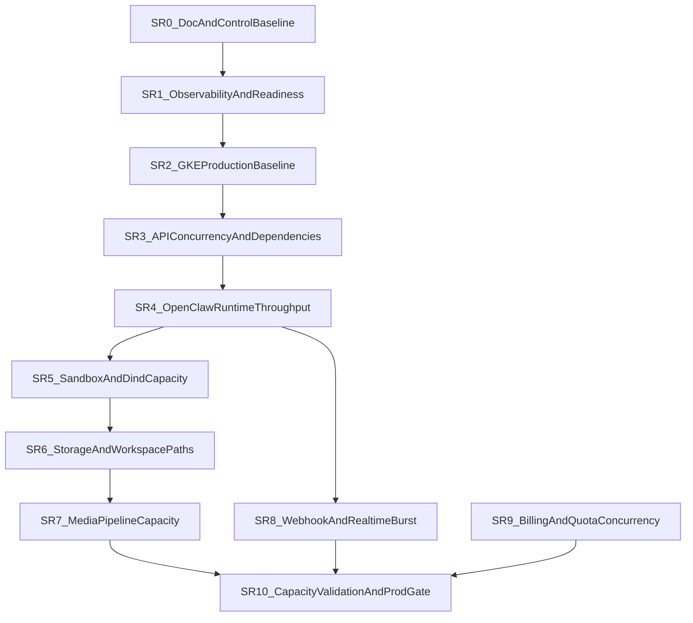

# SCALING-READINESS-PLAN

## Status
Working execution plan aligned with `ADR-070`.

## Resume Protocol
If a later Cursor session needs to recover context quickly, use this order:

1. `docs/SCALING-READINESS-PLAN.md`
2. `docs/ROADMAP.md`
3. `docs/SESSION-HANDOFF.md`
4. `docs/ADR/070-scaling-readiness-program-and-clean-delivery-discipline.md`
5. relevant supporting ADRs for the active slice

This file is the central execution plan for the scaling-readiness program.

## Purpose
Define one clean execution line for taking PersAI toward production-readiness for `1000–5000` online users without:

- losing context between Cursor-agent sessions
- mixing unrelated risk domains in one refactor
- deepening temporary compatibility paths
- stacking risky deploys without observation windows

## Program Principles
- PersAI remains the control plane; OpenClaw remains the execution plane.
- One session = one slice or one explicitly named sub-slice.
- Evidence first: confirmed bottlenecks, bounded hypotheses, explicit known risks.
- Clean delivery only: every temporary path must have a removal plan.
- No hidden parallel tracks: if a new concern appears, it becomes a named future slice or a new ADR-backed decision.

## Canonical Document Roles
- `ADR-070` = architecture, anti-scope rules, clean-delivery discipline
- `SCALING-READINESS-PLAN.md` = ordered slices, gates, handoff, current active slice
- `ROADMAP.md` = milestone visibility only
- `TEST-PLAN.md` = acceptance/load-test requirements only
- `SESSION-HANDOFF.md` = session progress only

## Cursor Agent Workflow
### Session entry protocol
Every agent starting or resuming a scaling slice must read:
1. this file
2. `docs/ROADMAP.md`
3. `docs/SESSION-HANDOFF.md`
4. `docs/ADR/070-scaling-readiness-program-and-clean-delivery-discipline.md`
5. supporting ADRs referenced by the active slice

### Parent vs subagent rule
- Only the parent agent updates canonical program docs.
- Subagents may gather evidence, but they do not become source-of-truth for slice state.

### Mandatory handoff fields
Each completed agent session must leave:
- active slice id
- what was completed
- what remains
- confirmed risks
- unresolved hypotheses
- metrics/tests still required
- next recommended step

## Clean Delivery Rules
### No-trash rule
Do not leave behind:
- indefinite compatibility paths
- duplicate old/new algorithms without a sunset plan
- stale rollout toggles with no owner and no removal condition
- forgotten scripts/checks that never became part of the operational baseline

### Clean replacement rule
Every slice must answer:
- what is being replaced
- what is being removed
- what remains as the deliberate baseline

### Hard stop rule
Do not start the next risky infra/runtime slice when the current one:
- failed smoke checks
- lacks observation-window evidence
- left unresolved regressions without owner
- left a temporary workaround without cleanup tracking

## Deploy And Verification Cadence
### Verification tiers
- `Tier 0` — static checks, lint, typecheck, contracts
- `Tier 1` — focused functional smoke
- `Tier 2` — deploy smoke in target environment
- `Tier 3` — observation window with metrics/log review
- `Tier 4` — targeted load/burst validation

### Default cadence
1. finish implementation for the active slice
2. run required Tier 0 / Tier 1 checks
3. deploy only the bounded affected surface
4. run Tier 2 smoke
5. wait through the required observation window
6. decide: close slice, rollback, or keep active

### Batching rule
Do not combine in one deploy window by default:
- GKE topology changes
- API concurrency semantics
- OpenClaw queue/sandbox changes
- storage/quota algorithm changes

## Active Program State
- `Current active slice`: `SR10` — Capacity validation and production gate
- `Current active sub-slice`: `SR10-pre-ui` — Admin observability dashboard restructuring
- `Current phase`: Capacity validation and production gate
- `Next recommended slice after SR10`: TBD
- `Last closed slice`: `SR9` — Billing and quota correctness under concurrency (closed 2026-04-07 after full live validation of all sub-slices SR9a–SR9f)
- `Post-SR5 baseline`: parallel sandbox image preload with retry, per-tier dind contention measured and documented, cross-pool isolation confirmed, predictable linear degradation under sandbox-heavy bursts
- `Post-SR6 baseline`: workspace quota enforcement is fail-safe on active guarded paths, oversized writes are bounded near quota instead of running away, post-command non-cleanup `exec` failures are surfaced as failed tool outcomes, and cleanup remains allowed under exceedance so remediation does not deadlock
- `Accepted residual (SR6)`: we do not claim that every one-shot oversized write always ends with ideal shell/`dd` exit-code semantics or zero overshoot before enforcement; remaining `dd`/exit-code presentation is accepted operational risk rather than an active blocker for opening `SR7`
- `Post-SR7 baseline`: PersAI-owned STT ingress paths use per-request transient scratch directories, bounded media-stage metrics cover STT and web staged uploads, and a short live parallel media burst completed with both API replicas staying ready, zero new `5xx`, zero pod restarts, and visible per-stage metric growth on the active pods
- `Accepted residual (SR7)`: this is an operational closure for bounded live media burst behavior and visibility, not a claim that the final throughput ceiling or full capacity envelope has been proven; that remains `SR10`
- `Post-SR8 baseline`: Telegram webhook ingress, web chat retry/reconnect, and reminder callback replay paths are now bounded by durable replay guards, and live validation confirmed normal web chat plus reminder delivery without duplicate fanout, with Telegram returning to normal behavior after manual rebind of one stale broken assistant binding
- `Accepted residual (SR8)`: we do not claim that the exact historical root cause of that stale Telegram binding state was isolated or automatically repaired by the replay-hardening package; `SR8` closes on the bounded replay/live behavior that was actually observed, while historical per-assistant binding corruption remains an accepted operational residual unless it recurs with fresh evidence
- `Post-SR9 baseline`: all six billing/quota sub-slices (SR9a–SR9f) live-validated: plan override propagation, token budget atomic accounting, dual media/workspace quota pre-check, active web chats cap, workspace subscription sync, and tool daily quota check-vs-consume are now correct under concurrency. Token budget exhaustion surfaces a dedicated `token_budget_exhausted` error code with user-facing banner (web + Telegram) instead of generic rate-limit. Admin ops auth middleware bug (missing route registrations) fixed and deployed
- `Accepted residual (SR9)`: none — all sub-slices closed cleanly with live validation; auth middleware bug was a registration omission, not a design flaw

## Slice Template
Each slice must use this shape:
- `Outcome`
- `In scope`
- `Out of scope`
- `Primary files / domains`
- `Preconditions`
- `Do not touch`
- `Evidence required`
- `Verification`
- `Rollback / safe fallback`
- `Removal / cleanup obligations`
- `Deploy window`
- `Observation window`
- `Exit criteria`
- `Agent handoff checklist`

## Slice Dependency Graph

## Slice Plan
### SR0 — Documentation And Control Baseline
Outcome:
- one umbrella ADR for scaling-readiness
- one central execution plan
- roadmap and test-plan aligned to the program
- explicit Cursor-agent workflow and clean-delivery rules

In scope:
- docs only
- naming, slice order, handoff protocol, deploy/verification cadence

Out of scope:
- code or infra behavior changes
- performance tuning
- runtime logic changes

Primary files / domains:
- `docs/ADR/070-...`
- `docs/SCALING-READINESS-PLAN.md`
- `docs/ROADMAP.md`
- `docs/TEST-PLAN.md`
- `docs/CHANGELOG.md`
- `docs/SESSION-HANDOFF.md`

Evidence required:
- docs are internally consistent
- active slice and next slice are explicit

Verification:
- manual docs consistency review

Rollback / safe fallback:
- docs-only revert if needed

Removal / cleanup obligations:
- none

Deploy window:
- none

Observation window:
- none

Exit criteria:
- future Cursor sessions can resume the program from docs only

Agent handoff checklist:
- confirm current active slice
- confirm next slice
- confirm supporting ADR set

### SR1 — Platform Baseline And Observability
Outcome:
- operationally meaningful readiness, metrics, logging, alerting baseline

In scope:
- API readiness/metrics hardening
- OpenClaw observability baseline
- dependency metrics requirements
- alert and dashboard definitions

Out of scope:
- HPA / pool topology changes
- runtime queue semantics

Primary files / domains:
- `apps/api/src/modules/platform-core/interface/http/*`
- `infra/helm/templates/openclaw-configmap.yaml`
- observability-related docs and runbooks

Deploy window:
- API and runtime config only

Observation window:
- short for metrics-only config, extended if readiness semantics change

Exit criteria:
- Tier 0–3 evidence for health and metrics visibility

### SR2 — GKE Production Baseline
Outcome:
- replicas, requests/limits, rollout/disruption/autoscaling baseline

In scope:
- deployment strategy
- HPA/PDB/topology rules
- node/pool assumptions

Out of scope:
- application concurrency semantics

Primary files / domains:
- `infra/helm/values*.yaml`
- `infra/helm/templates/*deployment*.yaml`
- `infra/helm/templates/*service*.yaml`

Deploy window:
- infra only

Observation window:
- mandatory extended observation

Exit criteria:
- stable multi-replica rollout and restart behavior in target env

### SR3 — API Concurrency And Dependency Hardening
Outcome:
- API behaves predictably under burst and multi-replica operation

In scope:
- DB pool strategy
- webhook burst path
- stream timeout/backpressure
- distributed rate-limit correctness

Out of scope:
- OpenClaw queue semantics

Primary files / domains:
- API persistence services
- webhook proxy
- abuse/rate-limit services
- adapter timeout paths

Deploy window:
- API only

Observation window:
- mandatory

Exit criteria:
- no hidden single-process correctness assumptions left in API control plane

### SR4 — OpenClaw Runtime Throughput And Multi-Replica Correctness
Outcome:
- honest production runtime baseline for the current OpenClaw model, with explicit queue evidence and explicit non-support for multi-replica session execution

In scope:
- queue model
- `maxConcurrent`
- Redis spec-store behavior
- multi-replica correctness
- restart/session continuity evidence

Out of scope:
- dind economics redesign

Primary files / domains:
- OpenClaw queue/config/spec-store/runtime bridge

Deploy window:
- runtime pools only

Observation window:
- mandatory extended observation

Exit criteria:
- supported production runtime path is explicit (`single_replica`, one pod per runtime pool)
- multi-replica session execution is either proven or explicitly prohibited by contract
- first single-replica throughput ceiling is explicit and no longer hidden behind ambiguous runtime behavior

### SR5 — Sandbox And dind Capacity Hardening
Outcome:
- sandbox throughput and dind startup behavior are bounded and predictable

In scope:
- image preload
- startup latency
- dind contention
- per-tier sandbox concurrency caps
- bounded deploy-gap reduction for sandbox-capable runtime pools
- predictable degradation under sandbox-heavy bursts

Out of scope:
- storage algorithm redesign (SR6)
- multi-replica session ownership redesign
- changing Recreate strategy to RollingUpdate (requires session handoff)

Primary files / domains:
- runtime pool Helm
- sandbox runtime config
- relevant ADRs and runbooks

Deploy window:
- runtime pools only

Observation window:
- mandatory extended observation

Exit criteria:
- sandbox-heavy bursts degrade predictably and do not destabilize unrelated tiers

#### SR5a — Sandbox startup path optimization and readiness budget baseline

Outcome:
- sandbox-capable runtime pools reach readiness faster by parallelizing image preload and adding operational resilience to the preload path

In scope:
- parallel docker pull for base + common sandbox images (was sequential)
- bounded retry with configurable attempt count for pull failures (was immediate crash)
- timestamped progress logging at each preload phase for operational visibility
- configurable `preloadPullRetries` Helm value
- documented startup path timeline and readiness budget

Out of scope:
- per-tier sandbox concurrency caps (later SR5 sub-slice)
- dind contention under concurrent sandbox sessions (later SR5 sub-slice)
- dind sidecar probe addition (later SR5 sub-slice — requires measuring dind startup variance)
- startupProbe budget tightening (requires deploy-time measurement first)
- Recreate→RollingUpdate change (out of SR5 entirely — requires session handoff)

Primary files / domains:
- `infra/helm/templates/openclaw-deployment.yaml` — preload shell script
- `infra/helm/values.yaml` — `preloadPullRetries` default

Evidence required:
- Helm template renders cleanly for both `values.yaml` and `values-dev.yaml`
- `runtime-pools:readiness:strict` gate passes
- all three sandbox-capable pools render the parallel pull + retry script

Verification:
- `Tier 0`: `helm template` for both value files + `runtime-pools:readiness:strict`
- `Tier 2`: deploy to dev, observe preload logs for `[sandbox-preload]` progress markers, verify readiness time improvement
- `Tier 3`: observation window for pod restart behavior, image pull latency, retry behavior under transient GAR errors

Rollback / safe fallback:
- revert Helm template to sequential pulls (single-line change); `preloadPullRetries` is additive and non-breaking
- no runtime code changes, no OpenClaw source changes

Deploy window:
- runtime pools only (sandbox-capable deployments)

Observation window:
- one deploy cycle with fresh pod rollout per sandbox pool

Exit criteria:
- preload logs show parallel pull completion
- pod readiness time is measurably reduced compared to sequential baseline
- retry path does not mask permanent pull failures (still exits after max attempts)

#### SR5b — dind contention baseline and per-tier sandbox capacity evidence

Outcome:
- measured dind CPU contention behavior under 4 concurrent CPU-bound sandbox sessions per tier
- documented per-tier capacity ceiling as confirmed evidence, not hypothesis

In scope:
- controlled stress test (4× concurrent `python3 sum(i*i for i in range(10**8))`) on all three sandbox-capable pools
- per-tier dind CPU/RAM measurement under contention
- pod stability verification (readiness, restarts) under sustained sandbox load

Out of scope:
- changing dind CPU limits (requires cost/capacity decision, not SR5b)
- changing `maxConcurrent` queue cap (queue semantics, not dind contention)
- sandbox session GC/TTL tuning (later SR5 sub-slice if needed)

Evidence (measured 2026-04-06):

| Pool | dind CPU limit | dind CPU at 4× stress | dind RAM at 4× | Slowdown | Pod stable |
|---|---|---|---|---|---|
| `free_shared_restricted_sandbox` | 1000m (1 core) | **741-1000m** (saturated) | 267-372 MiB / 1280 MiB | ~4× | Yes, 0 restarts |
| `paid_shared_restricted_sandbox` | 1000m (1 core) | **1001m** (saturated) | 297-372 MiB / 2304 MiB | ~4× | Yes, 0 restarts |
| `paid_isolated` | 2000m (2 cores) | **2000m** (saturated) | 288-294 MiB / 4352 MiB | ~2× | Yes, 0 restarts |

Key findings:
- dind CPU is the binding constraint; RAM has 70-90% headroom on all tiers
- 4 concurrent CPU-bound sandbox exec saturates dind CPU on all tiers
- degradation is linear/predictable (proportional to core count), not crash/OOM
- pod readiness never lost during sustained saturation — gateway stays healthy
- `paid_isolated` (2 cores) completes ~2× faster than shared tiers (1 core) under same load
- `docker stats` CPU% inside rootless dind is unreliable for monitoring — use `kubectl top` or dind-internal `top`

Confirmed capacity per tier (4 concurrent CPU-bound sandbox exec):
- `free_shared_restricted`: 1 core shared → each session gets ~250m effective → severe slowdown
- `paid_shared_restricted`: 1 core shared → same ceiling as free
- `paid_isolated`: 2 cores → each session gets ~500m effective → moderate slowdown

Verification:
- `Tier 2`: controlled stress test on live dev cluster, all three pools
- `Tier 3`: pod readiness confirmed stable through full test duration

Exit criteria:
- per-tier sandbox CPU ceiling is measured and documented as confirmed evidence
- degradation behavior is linear, not catastrophic
- pod stability under sustained dind saturation is proven

#### SR5 closure evidence (2026-04-06)

SR5 exit criteria: "sandbox-heavy bursts degrade predictably and do not destabilize unrelated tiers"

Confirmed:
- sandbox-heavy bursts (4× concurrent CPU-bound exec) degrade linearly with core count, not catastrophically
- dind CPU is the binding constraint; RAM has 70-90% headroom
- pod readiness never lost during sustained saturation on any tier
- cross-pool isolation confirmed: stress on free pool does not affect paid pools (separate nodes, separate dind, separate cgroup limits)
- `docker stats` unreliable in rootless dind; `kubectl top` and dind-internal `top` are honest signals

Accepted known risks:
- dind CPU limits are product/cost decisions, not technical blockers — current limits may need adjustment for higher concurrency targets
- sandbox session GC/TTL not stress-tested (HOT_CONTAINER_WINDOW_MS = 5 min keeps idle containers alive)
- IO-bound sandbox workloads not tested (only CPU-bound)
- node co-location of multiple sandbox pools re-introduces bandwidth contention during image pulls (observed ~2.5 min extra)

### SR6 — Storage And Workspace Path Hardening
Outcome:
- storage path remains predictable under workspace/file churn

In scope:
- GCS FUSE pressure
- many-small-files behavior
- cleanup cost
- workspace quota enforcement filesystem cost
- session/transcript FS behavior

Out of scope:
- media business semantics changes
- media preprocessing/offload redesign (`SR7`)
- quota atomicity, billing sync, and commercial correctness under concurrency (`SR9`)

Primary files / domains:
- workspace cleanup and quota guards
- storage path docs and tests

Deploy window:
- runtime and possibly API depending on changes

Observation window:
- mandatory

Exit criteria:
- no major hidden FUSE/cleanup amplification left in the active path

Closure note:
- `SR6` is closed operationally, not by the original strict `SR6f` ideal-exit-code bar. Production baseline now includes bounded oversized-write behavior, fail-safe quota measurement, mutation-cost reduction on known file paths, user-visible non-cleanup quota failure, and cleanup bypass under exceedance. The remaining gap is accepted operational risk: some one-shot `dd`/shell paths can still present a clean command exit even though quota enforcement already bounded growth and blocks subsequent work.

#### SR6a — Workspace quota cache invalidation parity for filesystem mutations

Outcome:
- workspace quota cache no longer stays stale just because the agent frees or atomically replaces files through the sandbox filesystem bridge instead of the `exec` path

In scope:
- sandbox filesystem mutation paths that can change effective workspace usage without going through `writeFile`
- cache invalidation parity for `remove` / `rename`
- docs clarification that `SR6` owns filesystem cost of quota enforcement, not `SR9` commercial correctness

Out of scope:
- changing quota semantics, limits, or billing correctness rules
- replacing cached `du -sb` with a different accounting architecture
- media preprocessing temp-file throughput or offload work (`SR7`)

Primary files / domains:
- `openclaw/src/agents/sandbox/fs-bridge.ts`
- focused OpenClaw tests for filesystem mutation paths
- `docs/SCALING-READINESS-PLAN.md`
- `docs/TEST-PLAN.md`
- `docs/SESSION-HANDOFF.md`
- `docs/ADR/069-workspace-storage-quota-and-dind-privileged-removal.md`

Evidence required:
- `writeFile`, `remove`, and `rename` all keep workspace quota cache invalidation behavior aligned
- no new claim is made that quota correctness under concurrency is solved beyond this filesystem-cost seam

Verification:
- `Tier 0`: OpenClaw typecheck plus focused quota/fs-bridge tests

Rollback / safe fallback:
- revert the `fs-bridge.ts` mutation-cache invalidation change; no schema or API contract change

Removal / cleanup obligations:
- if a later `SR6` pass replaces cached `du` entirely, remove this parity-only note and document the new baseline

Deploy window:
- OpenClaw runtime only

Observation window:
- not closeable from this pass alone; later `SR6` passes still need live evidence for broader FUSE/churn behavior

Exit criteria:
- sandbox delete/rename paths no longer leave a hidden stale-cache tail after freeing or replacing workspace files

#### SR6b — Mid-exec workspace quota watch for large-write bursts

Outcome:
- a single long-running `exec` command can no longer keep filling the workspace unchecked until exit; quota breach is detected during the run and the process is terminated

In scope:
- foreground `exec` path quota monitoring while the child process is still running
- bounded kill path when workspace usage crosses the configured limit mid-command
- docs correction for prior over-strong claims that the burst window was already closed

Out of scope:
- replacing cached `du -sb` with final incremental accounting
- quota correctness under concurrency or billing semantics (`SR9`)
- media preprocessing temp-file redesign (`SR7`)
- broader session/transcript churn closure for all `SR6`

Primary files / domains:
- `openclaw/src/agents/bash-tools.exec.ts`
- focused OpenClaw quota-watch tests
- `docs/ADR/069-workspace-storage-quota-and-dind-privileged-removal.md`
- `docs/TEST-PLAN.md`
- `docs/SESSION-HANDOFF.md`
- `docs/CHANGELOG.md`

Evidence required:
- a running non-cleanup `exec` is terminated when periodic quota checks observe the workspace over limit
- cleanup commands still bypass the kill path so over-quota remediation remains possible
- docs no longer claim the large-write burst window is fully closed beyond the evidence of this pass

Verification:
- `Tier 0`: OpenClaw typecheck plus focused quota-watch tests
- `Tier 2`: live repro using an oversized single-command write must stop near the quota boundary instead of reaching multi-GB growth

Rollback / safe fallback:
- revert the quota-watch loop in `bash-tools.exec.ts`; fall back to pre/post checks only

Removal / cleanup obligations:
- if a later `SR6` pass replaces periodic `du` polling with a different enforcement architecture, remove this stop-gap note and document the new active baseline

Deploy window:
- OpenClaw runtime only

Observation window:
- required; this pass is still not sufficient to close all of `SR6`

Exit criteria:
- a single foreground `exec` can no longer silently grow the workspace far past quota before the command exits

#### SR6c — Workspace quota measurement fail-safe semantics

Outcome:
- quota enforcement no longer silently weakens to "0 bytes used" just because `du -sb` failed or returned malformed output

In scope:
- `workspace-quota-guard.ts` measurement failure behavior
- fail-safe semantics for `exec` and sandbox `writeFile` when workspace usage cannot be measured
- docs correction so quota enforcement claims match the real guarded behavior

Out of scope:
- replacing `du -sb` with final incremental accounting
- transcript/session filesystem churn closure
- quota correctness under concurrency or billing semantics (`SR9`)
- media preprocessing/offload redesign (`SR7`)

Primary files / domains:
- `openclaw/src/agents/workspace-quota-guard.ts`
- `openclaw/src/agents/bash-tools.exec.ts`
- `openclaw/src/agents/sandbox/fs-bridge.ts`
- focused OpenClaw quota guard tests
- `docs/ADR/069-workspace-storage-quota-and-dind-privileged-removal.md`
- `docs/TEST-PLAN.md`
- `docs/SESSION-HANDOFF.md`
- `docs/CHANGELOG.md`

Evidence required:
- quota checks fail safe when measurement is unavailable or malformed
- non-cleanup `exec` does not continue under an unverified quota state
- sandbox `writeFile` does not proceed when quota cannot be measured

Verification:
- `Tier 0`: OpenClaw typecheck plus focused quota guard / exec / fs-bridge tests

Rollback / safe fallback:
- revert the measurement-failure handling and fall back to the prior permissive behavior

Removal / cleanup obligations:
- if a later `SR6` pass replaces `du -sb` entirely, remove this fail-safe note and document the new measurement contract

Deploy window:
- OpenClaw runtime only

Observation window:
- required; this still does not close all of `SR6`

Exit criteria:
- quota measurement failure no longer degrades into fail-open workspace growth on the active guarded paths

#### SR6d — First-poll quota watch tightening for fast oversized writes

Outcome:
- a single foreground `exec` can no longer evade the mid-exec quota watch just by finishing before the first scheduled quota sample

In scope:
- the first quota-watch scheduling window after `exec` spawn
- focused docs correction after live evidence showed a `700 MB` quota session still allowed one `800 MB` single-command write to finish and only blocked later commands
- focused regression coverage for the pre-fix blind window

Out of scope:
- replacing cached `du -sb` with final incremental accounting
- quota correctness under concurrency or billing semantics (`SR9`)
- media preprocessing temp-file redesign (`SR7`)
- broader session/transcript churn closure for all `SR6`

Primary files / domains:
- `openclaw/src/agents/bash-tools.exec.ts`
- focused OpenClaw quota-watch tests
- `docs/ADR/069-workspace-storage-quota-and-dind-privileged-removal.md`
- `docs/TEST-PLAN.md`
- `docs/SESSION-HANDOFF.md`
- `docs/CHANGELOG.md`

Evidence required:
- the first mid-exec quota sample happens early enough that a fast oversized single-command write does not rely only on post-command blocking
- focused tests cover the old "finishes before first poll" blind window
- docs no longer imply the deployed `SR6b` stop-gap already closed this fast-write gap before live proof

Verification:
- `Tier 0`: OpenClaw typecheck plus focused quota-watch tests
- `Tier 2`: rerun the single-command oversized write repro and confirm the same command is terminated by the quota watch instead of succeeding and only blocking follow-up commands

Rollback / safe fallback:
- revert the first-poll tightening in `bash-tools.exec.ts`; fall back to the slower `SR6b` polling-only stop-gap

Removal / cleanup obligations:
- if a later `SR6` pass replaces periodic `du` polling with a different enforcement architecture, remove this stop-gap note and document the new active baseline

Deploy window:
- OpenClaw runtime only

Observation window:
- required; this still does not close all of `SR6`

Exit criteria:
- a single foreground `exec` can no longer avoid mid-exec enforcement purely because it finishes before the first scheduled quota-watch sample

#### SR6e — Known file-mutation quota cache delta accounting

Outcome:
- known file mutations no longer force a full workspace re-measure on the next guarded operation when the runtime already knows the exact byte delta

In scope:
- quota-cache updates for known file mutations on sandbox `writeFile`, file `remove`, and file-overwrite `rename`
- reducing avoidable `du -sb` pressure on active file-mutation paths without changing quota semantics
- truthful docs update after `SR6d` live evidence showed the remaining tail had shifted from burst correctness to storage-cost amplification

Out of scope:
- replacing cached `du -sb` with final incremental accounting for all paths
- recursive directory-delete accounting beyond safe fallback invalidation
- quota correctness under concurrency or billing semantics (`SR9`)
- media preprocessing temp-file redesign (`SR7`)
- broader session/transcript cleanup redesign

Primary files / domains:
- `openclaw/src/agents/workspace-quota-guard.ts`
- `openclaw/src/agents/sandbox/fs-bridge.ts`
- focused OpenClaw quota / fs-bridge tests
- `docs/SCALING-READINESS-PLAN.md`
- `docs/TEST-PLAN.md`
- `docs/SESSION-HANDOFF.md`
- `docs/CHANGELOG.md`

Evidence required:
- file overwrite/delete/overwrite-rename paths update the cached workspace usage using known byte deltas instead of always forcing the next guarded read back to `du -sb`
- recursive or directory-shaped mutations still fail safe through cache invalidation
- docs no longer overstate `SR6` as already fully closed while this cost-reduction pass is still in flight

Verification:
- `Tier 0`: OpenClaw typecheck plus focused quota / fs-bridge tests
- `Tier 2`: after deploy, rerun one representative workspace-mutation-heavy flow and confirm the remaining `SR6` decision is now about accepted residual risks rather than a still-open hidden mutation-cost tail

Rollback / safe fallback:
- revert the `fs-bridge` cache-delta accounting and fall back to invalidation-only behavior

Removal / cleanup obligations:
- if a later `SR6` or post-`SR6` pass replaces cached `du -sb` entirely, remove this delta-accounting stop-gap and document the new baseline

Deploy window:
- OpenClaw runtime only

Observation window:
- required before calling all of `SR6` closed

Exit criteria:
- known file-mutation paths no longer create an avoidable full-workspace re-measure tail on the next guarded operation

#### SR6f — One-shot oversized write runtime stop closure

Outcome:
- one oversized foreground write no longer behaves like an unbounded runaway storage path, and quota-triggered failure is surfaced to the user even though ideal shell exit-code semantics are not guaranteed on every live `dd` path

In scope:
- truthful program-state correction after post-`SR6e` live evidence
- the remaining active `exec` quota-watch gap for one-shot oversized writes
- bounded runtime-side fix selection inside `SR6`, not `SR7` or `SR9`

Out of scope:
- replacing cached `du -sb` with final incremental accounting for all paths
- media preprocessing temp-file redesign (`SR7`)
- quota correctness under concurrency or billing semantics (`SR9`)
- broad transcript/session cleanup redesign

Primary files / domains:
- `openclaw/src/agents/bash-tools.exec.ts`
- focused OpenClaw quota-watch tests
- `docs/SCALING-READINESS-PLAN.md`
- `docs/ROADMAP.md`
- `docs/SESSION-HANDOFF.md`
- `docs/TEST-PLAN.md`

Evidence required:
- oversized one-shot writes are bounded near quota instead of running away to multi-GB growth
- post-command non-cleanup quota violations are surfaced as failed tool outcomes in the runtime/UI path
- ordinary file mutations and cleanup continue to work without false quota deadlocks

Verification:
- `Tier 0`: OpenClaw typecheck plus focused quota-watch tests
- `Tier 2`: live repro confirmed that oversized writes are cut off near the quota boundary, follow-up commands are blocked, and cleanup remains allowed; this pass does not claim the stricter "clean shell success impossible" outcome on every `dd` path

Rollback / safe fallback:
- revert the bounded runtime-stop change and fall back to the current polling-based behavior

Removal / cleanup obligations:
- if a later `SR6` or post-`SR6` pass replaces periodic `du` polling entirely, remove this stop-gap note and document the new runtime baseline

Deploy window:
- OpenClaw runtime only

Observation window:
- completed for operational closure; future work should revisit only if the residual `dd`/exit-code semantics cause real abuse or support pain

Exit criteria:
- one-shot oversized writes are operationally bounded near quota, user-visible quota failure is preserved, ordinary mutations keep working, and cleanup is still allowed under exceedance

### SR7 — Media Pipeline Capacity Hardening
Outcome:
- media path no longer dominates API/runtime under burst

In scope:
- concurrent uploads
- STT/TTS/image/pdf preprocessing
- temp-file lifecycle
- worker/offload decision

Out of scope:
- provider-routing redesign

Primary files / domains:
- media preprocessor and media services

Deploy window:
- API and affected runtime/media config

Observation window:
- mandatory

Exit criteria:
- media bursts are bounded and visible operationally

#### SR7a — STT scratch isolation and bounded media-stage visibility
Outcome:
- PersAI-owned STT ingress paths no longer share one runtime scratch directory across concurrent transcriptions, and the API exposes bounded stage-level signals for the touched media-heavy paths

In scope:
- per-request transient STT scratch location on the runtime media path used by `MediaPreprocessorService`
- per-request transient STT scratch location for direct web voice transcription in `ManageChatMediaService`
- scoped cleanup after transcription so one request cannot delete another request's in-flight scratch files
- bounded stage-level metrics for touched media-heavy API paths (`stt_transcribe`, inbound resolve, outbound delivery persist)
- docs correction for the active baseline after choosing the first bounded `SR7` sub-slice

Out of scope:
- webhook/realtime retry or fan-in behavior (`SR8`)
- quota ordering/atomicity and billing correctness under concurrency (`SR9`)
- broad worker/offload redesign for all media preprocessing

Primary files / domains:
- `apps/api/src/modules/platform-core/application/platform-http-metrics.service.ts`
- `apps/api/src/modules/platform-core/interface/http/metrics.controller.ts`
- `apps/api/src/modules/workspace-management/application/media/media-preprocessor.service.ts`
- `apps/api/src/modules/workspace-management/application/manage-chat-media.service.ts`
- `apps/api/src/modules/workspace-management/application/media/inbound-media.service.ts`
- `apps/api/src/modules/workspace-management/application/media/media-delivery.service.ts`
- `apps/api/test/platform-http-metrics.service.test.ts`
- `apps/api/test/platform-readiness.service.test.ts`
- `apps/api/test/media-preprocessor.service.test.ts`
- `apps/api/test/manage-chat-media.transcribe-voice.test.ts`
- `apps/api/test/media-delivery.service.test.ts`
- `docs/SCALING-READINESS-PLAN.md`
- `docs/TEST-PLAN.md`
- `docs/SESSION-HANDOFF.md`

Evidence required:
- consecutive or concurrent STT preprocessing calls use distinct transient media directories instead of the shared `_stt_tmp` path
- direct web voice transcription calls use distinct transient media directories instead of the shared `_voice_tmp` path
- cleanup is scoped to the transient directory created by the same transcription request
- bounded metrics expose the touched media stages in `/metrics` so later `SR7` observation does not depend only on logs
- docs no longer describe shared lazy `_stt_tmp` cleanup as the active baseline

Verification:
- `Tier 0`: `corepack pnpm --filter @persai/api run typecheck`
- `Tier 0`: `corepack pnpm --filter @persai/api exec tsx test/platform-http-metrics.service.test.ts`
- `Tier 0`: `corepack pnpm --filter @persai/api exec tsx test/platform-readiness.service.test.ts`
- `Tier 0`: `corepack pnpm --filter @persai/api exec tsx test/media-preprocessor.service.test.ts`
- `Tier 0`: `corepack pnpm --filter @persai/api exec tsx test/manage-chat-media.transcribe-voice.test.ts`
- `Tier 0`: `corepack pnpm --filter @persai/api exec tsx test/media-delivery.service.test.ts`

Rollback / safe fallback:
- revert `MediaPreprocessorService` / `ManageChatMediaService` to the old shared `_stt_tmp` / `_voice_tmp` scratch paths and per-file cleanup

Removal / cleanup obligations:
- if a later `SR7` pass moves STT preprocessing to a worker/offload model or to a different transient-storage contract, remove this scratch-directory note and document the new baseline

Deploy window:
- API only

Observation window:
- required; this sub-slice does not close all of `SR7`

Exit criteria:
- the PersAI-owned STT ingress paths no longer rely on shared `_stt_tmp` / `_voice_tmp` directories that can be deleted by another in-flight transcription
- focused verification proves cleanup still runs after success and after STT failure across both touched STT ingress paths
- `/metrics` exposes bounded stage-level signals for the touched media-heavy paths so the first `SR7` deploy has an observation surface beyond generic HTTP latency

#### SR7b — Web staged attachment visibility parity
Outcome:
- the same bounded media-stage visibility model now covers the web staged attachment path, so web image/file uploads participate in the shared `SR7` observation surface instead of remaining a blind spot

In scope:
- one bounded stage-level metric around `ManageChatMediaService.stageForWebThread`
- success/failure visibility for the web staged upload path after validation, optional preprocessing, quota gate, and runtime upload/persist
- focused regression coverage for the new `web_stage_attachment` metric family output
- active-state docs correction so canon reflects the truthful current `SR7` sub-slice after `SR7a`

Out of scope:
- webhook/realtime burst behavior (`SR8`)
- quota or billing correctness under concurrency (`SR9`)
- broad media worker/offload redesign
- splitting web uploads into multiple new internal stages unless live evidence proves that one stage is insufficient

Primary files / domains:
- `apps/api/src/modules/workspace-management/application/manage-chat-media.service.ts`
- `apps/api/test/manage-chat-media.stage-web-thread.test.ts`
- `apps/api/test/platform-readiness.service.test.ts`
- `docs/SCALING-READINESS-PLAN.md`
- `docs/TEST-PLAN.md`
- `docs/ROADMAP.md`
- `docs/CHANGELOG.md`
- `docs/SESSION-HANDOFF.md`

Evidence required:
- `stageForWebThread` records bounded success/failure stage metrics without changing the user-visible upload contract
- `/metrics` serializes `web_stage_attachment` series alongside the existing `SR7a` media-stage families
- docs no longer imply that only STT/inbound/delivery touched paths are inside the current observation baseline

Verification:
- `Tier 0`: `corepack pnpm --filter @persai/api run typecheck`
- `Tier 0`: `corepack pnpm --filter @persai/api exec tsx test/manage-chat-media.stage-web-thread.test.ts`
- `Tier 0`: `corepack pnpm --filter @persai/api exec tsx test/platform-readiness.service.test.ts`

Rollback / safe fallback:
- remove the `web_stage_attachment` metric recording from `ManageChatMediaService.stageForWebThread`

Removal / cleanup obligations:
- if a later `SR7` pass replaces this single web staged-upload metric with a richer queue/worker or multi-stage visibility model, remove this sub-slice note and document the new active baseline

Deploy window:
- API only

Observation window:
- required; this sub-slice still does not close all of `SR7`

Exit criteria:
- the web staged attachment path is visible in `/metrics` through the same bounded media-stage model already used for the touched `SR7a` paths
- focused tests prove both direct metric recording and Prometheus serialization for `web_stage_attachment`
- canon reflects this parity pass as the truthful current active `SR7` sub-slice instead of leaving it as undocumented follow-up work

### SR8 — Webhook And Realtime Burst Hardening
Outcome:
- Telegram/web stream/internal callback fan-in survives burst predictably

In scope:
- Telegram fan-in
- web stream resilience
- retry/idempotency
- controlled overload

Out of scope:
- quota accounting redesign

Primary files / domains:
- webhook proxy
- stream transport
- realtime retry/idempotency paths

Deploy window:
- API and relevant routing/runtime ingress

Observation window:
- mandatory

Exit criteria:
- burst behavior is measured and bounded

#### SR8b — Combined webhook/realtime replay closure package
Outcome:
- Telegram, web chat, and internal reminder callback ingress behave predictably under duplicate deliveries, replay, and transient retry conditions so `SR8` can be closed on one bounded combined package

In scope:
- Telegram internal turn replay/idempotency before quota/runtime work begins
- OpenClaw runtime-side Telegram deduplicated no-op handling so duplicate updates do not emit `...`
- atomic claim/release/complete handling for one `assistantId + updateId` path on the PersAI side
- web chat sync/stream replay protection keyed by one client-provided `clientTurnId`
- bounded duplicate suppression for same logical web turn while one attempt is already in flight
- reminder callback replay protection keyed by one logical cron-finished delivery identity
- Telegram webhook proxy transient upstream timeout/error semantics so retry-worthy failures are not silently acknowledged as success
- OpenClaw cron callback failure logging so non-2xx internal webhook completion does not masquerade as success
- docs correction so `SR8` has one truthful final combined closure package and verification baseline

Out of scope:
- quota/billing/accounting correctness under duplicated deliveries (`SR9`)
- final burst-capacity envelope proof (`SR10`)
- media preprocessing/offload changes (`SR7`)

Primary files / domains:
- `apps/api/src/modules/workspace-management/application/handle-internal-telegram-turn.service.ts`
- `apps/api/src/modules/workspace-management/application/send-web-chat-turn.service.ts`
- `apps/api/src/modules/workspace-management/application/stream-web-chat-turn.service.ts`
- `apps/api/src/modules/workspace-management/application/handle-internal-cron-fire.service.ts`
- `apps/api/src/modules/workspace-management/interface/http/telegram-webhook-proxy.controller.ts`
- `apps/api/src/modules/workspace-management/interface/http/assistant.controller.ts`
- `apps/api/src/modules/workspace-management/domain/assistant-channel-surface-binding.repository.ts`
- `apps/api/src/modules/workspace-management/infrastructure/persistence/prisma-assistant-channel-surface-binding.repository.ts`
- `apps/web/app/app/assistant-api-client.ts`
- `apps/web/app/app/_components/use-chat.ts`
- `openclaw/src/gateway/persai-runtime/persai-runtime-telegram.ts`
- `openclaw/src/gateway/server-cron.ts`
- focused API/OpenClaw tests for Telegram internal turn replay handling, web replay handling, reminder callback replay handling, and callback retry semantics
- `docs/SCALING-READINESS-PLAN.md`
- `docs/TEST-PLAN.md`
- `docs/SESSION-HANDOFF.md`

Evidence required:
- concurrent or repeated delivery of the same Telegram `updateId` does not start more than one runtime turn from PersAI
- the replay guard is acquired before quota usage and runtime execution, not only after success is written back
- failed attempts release or age out the in-flight claim so the same update is not deadlocked forever after one broken attempt
- concurrent or repeated delivery of the same web `clientTurnId` does not create more than one persisted user-visible turn or more than one runtime execution
- repeated delivery of the same logical reminder callback does not append more than one reminders-chat message or more than one Telegram reminder send
- Telegram proxy timeout/network failures return a retry-worthy non-2xx response instead of a false success acknowledgement
- transient `OpenClaw -> PersAI internal Telegram turn` failures are not converted into a successful webhook acknowledgment with fallback user text; retry-worthy internal-turn failures remain retry-worthy at the webhook boundary
- OpenClaw cron webhook non-2xx completion is surfaced as failure in runtime logs instead of silent success
- docs do not overclaim that quota/billing correctness (`SR9`) or final envelope proof (`SR10`) were solved by this combined replay package

Verification:
- `Tier 0`: `corepack pnpm --filter @persai/api run typecheck`
- `Tier 0`: `corepack pnpm --filter @persai/api exec tsx test/handle-internal-telegram-turn.service.test.ts`
- `Tier 0`: `corepack pnpm --filter @persai/api exec tsx test/internal-runtime-turn.controller.test.ts`
- `Tier 0`: `corepack pnpm --filter @persai/api exec tsx test/telegram-webhook-proxy.controller.test.ts`
- `Tier 0`: `corepack pnpm --filter @persai/api exec tsx test/send-web-chat-turn.service.test.ts`
- `Tier 0`: `corepack pnpm --filter @persai/api exec tsx test/stream-web-chat-turn.service.test.ts`
- `Tier 0`: `corepack pnpm --filter @persai/api exec tsx test/handle-internal-cron-fire.test.ts`
- `Tier 0`: `corepack pnpm --filter @persai/web run test -- app/app/assistant-api-client.test.ts`
- `Tier 0`: `corepack pnpm --dir "C:\Users\alex\Documents\openclaw" exec vitest run src/gateway/persai-runtime/persai-runtime-telegram.test.ts src/gateway/server-cron.test.ts`
- `Tier 0`: `corepack pnpm --dir "C:\Users\alex\Documents\openclaw" exec tsc --noEmit`

Rollback / safe fallback:
- revert the web/reminder replay claim logic and Telegram/OpenClaw retry semantics changes, falling back to the pre-`SR8b` behavior where duplicate retries could still create repeated user-visible work

Removal / cleanup obligations:
- if a later `SR8` successor or post-`SR8` pass introduces a more general inbox/queue/idempotency architecture, remove this metadata-claim stop-gap and document the new baseline

Deploy window:
- API plus OpenClaw runtime/gateway

Observation window:
- completed before `SR8` closure; retained here as the historical live gate that was satisfied before `SR9` opened

Exit criteria:
- same-update Telegram retries no longer create duplicate concurrent inbound turns on the PersAI side
- duplicate suppression is bounded and recoverable after failure
- same logical web turn keyed by `clientTurnId` no longer creates duplicate runtime work or duplicate persisted user-visible turns on replay/reconnect
- same logical reminder callback no longer creates duplicate reminder fanout to web or Telegram
- Telegram transient upstream failures are no longer silently acknowledged as successful webhook deliveries at the proxy layer
- transient internal-turn failures no longer collapse into a false-success Telegram webhook completion on the runtime side
- cron callback non-2xx completion is observable as runtime failure instead of false success
- canon reflects this combined replay package as the truthful final `SR8` sub-slice instead of leaving `SR8` fragmented across undocumented follow-ups

### SR9 — Billing And Quota Correctness Under Concurrency
Outcome:
- quota, billing, and plan changes remain predictable under concurrency

In scope:
- quota atomicity
- race-safe enforcement
- plan propagation
- real billing sync assumptions

Out of scope:
- unrelated UX changes

Primary files / domains:
- quota tracking
- subscription resolution
- enforcement points

Deploy window:
- API only

Observation window:
- mandatory

Exit criteria:
- concurrent usage cannot silently violate commercial boundaries in common paths

#### SR9a — Assistant plan override propagation correctness
Outcome:
- assistant-level commercial plan override changes no longer rely on unrelated invalidation to reach the materialized runtime contract

In scope:
- assistant admin plan override set/reset path
- lazy-refresh invalidation parity for this per-assistant plan propagation seam
- docs correction for the actual effective subscription precedence and current `SR9` active state

Out of scope:
- atomic quota reservation/check+consume redesign across concurrent requests
- workspace subscription webhook integration
- final load or burst-capacity proof (`SR10`)

Primary files / domains:
- `apps/api/src/modules/workspace-management/application/manage-admin-assistant-plan-override.service.ts`
- focused API tests for assistant plan override propagation
- `docs/SCALING-READINESS-PLAN.md`
- `docs/ROADMAP.md`
- `docs/SESSION-HANDOFF.md`
- `docs/TEST-PLAN.md`
- `docs/ADR/026-subscription-state-and-billing-abstraction-p3.md`
- `docs/ADR/054-config-generation-lazy-invalidation-h3-1.md`
- `docs/ARCHITECTURE.md`

Evidence required:
- assistant plan override set/reset marks the assistant stale for the existing lazy-refresh path instead of waiting for an unrelated generation bump
- canon reflects the actual effective subscription precedence implemented in code (`assistant_plan_override -> workspace_subscription -> assistant_plan_fallback -> catalog_default_fallback -> none`)
- docs no longer imply that `SR9` is unopened or that `SR8` still blocks it

Verification:
- `Tier 0`: `corepack pnpm --filter @persai/api run typecheck`
- `Tier 0`: `corepack pnpm --filter @persai/api exec tsx test/manage-admin-assistant-plan-override.service.test.ts`
- `Tier 0`: `corepack pnpm --filter @persai/api exec tsx test/subscription-state-resolve.test.ts`

Rollback / safe fallback:
- revert the `configDirtyAt` write in `ManageAdminAssistantPlanOverrideService`; the system falls back to the prior stale-until-unrelated-refresh behavior

Removal / cleanup obligations:
- if a later `SR9` pass replaces TTL-based lazy propagation for per-assistant plan changes with a stronger immediate-sync contract, remove this invalidation-only note and document the new baseline

Deploy window:
- API only

Observation window:
- **SR9a closed** — live-validated 2026-04-07: plan override apply/delete confirmed working after auth middleware fix deploy; token budget enforcement confirmed with dedicated `token_budget_exhausted` error banner

Exit criteria:
- assistant override changes are no longer indefinitely stale on the runtime/materialized path
- canon is truthful about `SR9` being active and about the implemented subscription precedence

#### SR9b — Token budget atomic accounting under concurrency
Outcome:
- concurrent token-budget accounting no longer allows the shared quota ledger to overshoot the configured limit just because multiple turns record usage at the same time

In scope:
- token budget shared-state accounting on the PersAI API side
- serializable capped increment semantics for the current `chars_div_4_ceil_v1` token estimator
- truthful docs update for the active `SR9` sub-slice and its remaining deploy/live-test bar

Out of scope:
- replacing the current estimator with provider-exact token telemetry
- pre-runtime reservation/degrade redesign across the full turn lifecycle
- media-storage or active-chat-cap atomicity (`SR9c` / `SR9d`)
- final capacity proof (`SR10`)

Primary files / domains:
- `apps/api/src/modules/workspace-management/infrastructure/persistence/prisma-workspace-quota-accounting.repository.ts`
- `apps/api/src/modules/workspace-management/domain/workspace-quota-accounting.repository.ts`
- `apps/api/src/modules/workspace-management/application/track-workspace-quota-usage.service.ts`
- focused API quota-accounting tests
- `docs/SCALING-READINESS-PLAN.md`
- `docs/ROADMAP.md`
- `docs/SESSION-HANDOFF.md`
- `docs/TEST-PLAN.md`

Evidence required:
- token-budget usage writes use one serializable shared-state path that caps the applied delta against the remaining budget instead of blindly incrementing past the limit
- usage events record the applied delta that actually reached the ledger
- canon does not overclaim that pre-runtime quota decisions are now fully reservation-atomic or that all of `SR9` is closed

Verification:
- `Tier 0`: `corepack pnpm --filter @persai/api run typecheck`
- `Tier 0`: `corepack pnpm --filter @persai/api exec tsx test/quota-accounting.test.ts`
- `Tier 0`: `corepack pnpm --filter @persai/api exec tsx test/prisma-workspace-quota-accounting.repository.test.ts`
- `Tier 0`: `corepack pnpm --filter @persai/api exec tsx test/enforcement-points.test.ts`

Rollback / safe fallback:
- revert the capped serializable token-budget write path and fall back to the previous blind post-turn increment behavior

Removal / cleanup obligations:
- if a later `SR9` pass replaces estimator-based post-turn accounting with a stronger reservation or provider-exact usage contract, remove this capped-ledger note and document the new baseline

Deploy window:
- API only

Observation window:
- **SR9b closed** — live-validated 2026-04-07: token budget enforcement confirmed under normal usage

Exit criteria:
- concurrent post-turn token-budget accounting can no longer push the shared ledger above the configured token limit on the touched path
- docs remain explicit that pre-runtime degrade decisions still use the current non-reservation model and therefore `SR9` remains open

#### SR9c — Media storage quota atomicity under concurrency
Outcome:
- concurrent media uploads no longer retain quota-violating stored bytes just because multiple upload paths race through the same workspace media ledger
- touched cleanup/delete paths no longer leave the workspace logically full after quota-capped uploads or explicit media cleanup on the PersAI side
- user uploads are blocked when the workspace disk is physically full, even if the media upload budget has headroom — preventing uploads that would fail at the sandbox layer
- admin UI clearly separates "total sandbox disk" from "user upload budget" so operators understand the relationship between the two quotas

In scope:
- `media_storage_bytes` shared-state accounting on the PersAI API side
- atomic capped media-byte apply semantics plus rollback of the newly uploaded blob when the full object no longer fits
- bounded release/reconciliation of `media_storage_bytes` on the touched PersAI delete/cleanup paths needed to restore honest workspace headroom after cleanup
- alignment of docs that previously overstated inbound media pre-check coverage
- **dual quota pre-check for uploads (Variant B):** before accepting a user upload (web stage-attachment, Telegram inbound media), the API checks BOTH (a) media upload budget (`mediaStorageBytesUsed < mediaStorageBytesLimit`) AND (b) workspace storage availability (current sandbox disk usage from OpenClaw < `workspaceStorageBytesLimit`). If either check fails, the upload is rejected with an appropriate user-facing error
- **admin UI rename for clarity:** "Workspace storage (MB)" = total sandbox disk limit (enforced by OpenClaw via `du -sb`, covers everything: agent files, downloads, user uploads). "Media upload budget (MB)" / "Media storage (MB)" = user upload allowance within that disk (enforced by PersAI API, tracks only user-uploaded content). Both quotas remain independently configurable per plan
- **workspace storage pre-check implementation:** the PersAI API queries OpenClaw for the current sandbox disk usage before accepting uploads, using the existing runtime adapter pattern

Out of scope:
- media preprocessing throughput redesign (`SR7`)
- full cross-system media lifecycle reconciliation beyond the touched PersAI-owned cleanup/delete seams
- token-budget or active-chat-cap atomicity (`SR9b` / `SR9d`)
- final capacity proof (`SR10`)
- replacing OpenClaw's workspace storage enforcement (`du -sb`) with a different mechanism
- removing or merging the two quotas into one — they serve different enforcement layers

Primary files / domains:
- `apps/api/src/modules/workspace-management/infrastructure/persistence/prisma-workspace-quota-accounting.repository.ts`
- `apps/api/src/modules/workspace-management/domain/workspace-quota-accounting.repository.ts`
- `apps/api/src/modules/workspace-management/application/track-workspace-quota-usage.service.ts`
- `apps/api/src/modules/workspace-management/application/manage-chat-media.service.ts`
- `apps/api/src/modules/workspace-management/application/media/inbound-media.service.ts`
- `apps/api/src/modules/workspace-management/application/media/media.types.ts`
- `apps/api/src/modules/workspace-management/application/handle-internal-telegram-turn.service.ts`
- `apps/web/app/admin/plans/page.tsx` (admin UI label rename)
- `apps/web/app/app/_components/chat-area.tsx` (web chat error rendering)
- focused API media/quota tests
- `docs/SCALING-READINESS-PLAN.md`
- `docs/ROADMAP.md`
- `docs/SESSION-HANDOFF.md`
- `docs/TEST-PLAN.md`
- `docs/ADR/067-application-layer-security-hardening.md`

Evidence required:
- media-byte usage writes use one serializable capped shared-state path instead of a blind increment
- when the uploaded object no longer fully fits, the newly uploaded blob is deleted and no attachment row is retained on the touched path
- touched PersAI cleanup/delete paths release `media_storage_bytes` through one bounded shared-state seam so cleanup restores upload headroom instead of leaving stale ledger usage
- **upload pre-check blocks when workspace disk is full**, even if media upload budget has headroom — preventing "media OK but disk full" uploads that would fail silently at the sandbox layer
- **upload pre-check blocks when media budget is exceeded**, even if workspace disk has headroom — keeping the per-user upload allowance enforced
- **admin UI clearly separates the two quotas** with labels that explain each one's role
- docs stay honest that this pass hardens touched PersAI-owned retain/release correctness, not the whole long-term cross-system media reconciliation story

Verification:
- `Tier 0`: `corepack pnpm --filter @persai/api run typecheck`
- `Tier 0`: `corepack pnpm --filter @persai/api exec tsx test/manage-chat-media.stage-web-thread.test.ts`
- `Tier 0`: `corepack pnpm --filter @persai/api exec tsx test/inbound-media.service.test.ts`
- `Tier 0`: `corepack pnpm --filter @persai/api exec tsx test/manage-web-chat-list.service.test.ts`
- `Tier 0`: `corepack pnpm --filter @persai/api exec tsx test/admin-delete-user.service.test.ts`
- `Tier 0`: `corepack pnpm --filter @persai/api exec tsx test/prisma-workspace-quota-accounting.repository.test.ts`
- `Tier 0`: `corepack pnpm --filter @persai/api exec tsx test/quota-accounting.test.ts`

Rollback / safe fallback:
- revert the capped media-byte write path and rollback-on-cap behavior, falling back to the prior pre-check plus blind post-upload increment behavior

Removal / cleanup obligations:
- if a later `SR9` or post-`SR9` pass replaces post-upload media-byte accounting with a stronger reservation/decrement reconciliation model, remove this rollback-on-cap note and document the new baseline

Deploy window:
- API only

Observation window:
- **SR9c closed** — live-validated 2026-04-07: dual quota pre-check (media budget + workspace disk) confirmed working in both web and Telegram

Exit criteria:
- touched upload paths no longer retain media blobs above the workspace media-storage limit purely because concurrent uploads raced through the same ledger
- touched PersAI cleanup/delete paths no longer leave stale `media_storage_bytes` usage that blocks later uploads after cleanup
- user uploads are rejected with a clear error when workspace disk is physically full, regardless of media budget headroom
- user uploads are rejected with a clear error when media upload budget is exceeded, regardless of workspace disk headroom
- admin UI labels clearly communicate the relationship between workspace storage (total disk) and media upload budget (user upload allowance)
- docs remain explicit that full media-byte reconciliation across every possible external/runtime lifecycle is not yet claimed here

#### SR9d — Active web chats cap race-safe creation
Outcome:
- concurrent creation of new web chat threads can no longer silently overshoot the configured active-chat commercial cap on the touched web paths

In scope:
- race-safe enforcement of `WEB_ACTIVE_CHATS_CAP` at the moment a new active web chat row would be created
- closing the `count -> enforce -> create` gap for new web-thread creation
- closing the staged web attachment path as a second create seam so it cannot bypass the active-chat cap

Out of scope:
- chat UX/list/history redesign
- abuse/rate-limit redesign
- token-budget or media-storage atomicity (`SR9b` / `SR9c`)
- final capacity proof (`SR10`)

Primary files / domains:
- `apps/api/src/modules/workspace-management/domain/assistant-chat.repository.ts`
- `apps/api/src/modules/workspace-management/infrastructure/persistence/prisma-assistant-chat.repository.ts`
- `apps/api/src/modules/workspace-management/application/prepare-assistant-inbound-turn.service.ts`
- `apps/api/src/modules/workspace-management/application/manage-chat-media.service.ts`
- focused API chat/media tests
- `docs/SCALING-READINESS-PLAN.md`
- `docs/ROADMAP.md`
- `docs/SESSION-HANDOFF.md`
- `docs/TEST-PLAN.md`

Evidence required:
- new web-chat creation uses one serializable shared-state path that either returns the existing thread, creates under cap, or rejects when the cap is already full
- the staged web attachment path cannot create a fresh active web chat while bypassing that same cap contract
- docs stay honest that this pass proves bounded active-chat-cap atomicity on touched web creation paths, not full `SR9` closure

Verification:
- `Tier 0`: `corepack pnpm --filter @persai/api run typecheck`
- `Tier 0`: `corepack pnpm --filter @persai/api exec tsx test/prepare-assistant-inbound-turn.service.test.ts`
- `Tier 0`: `corepack pnpm --filter @persai/api exec tsx test/manage-chat-media.stage-web-thread.test.ts`
- `Tier 0`: `corepack pnpm --filter @persai/api exec tsx test/prisma-assistant-chat.repository.test.ts`
- `Tier 0`: `corepack pnpm --filter @persai/api exec tsx test/stream-web-chat-turn.service.test.ts`

Rollback / safe fallback:
- revert the serializable web-chat reservation path and return to the previous pre-count plus create behavior

Removal / cleanup obligations:
- if a later `SR9` or post-`SR9` pass replaces this row-count-based cap contract with a stronger reservation or reconciliation model, remove this temporary concurrency note and document the new source of truth

Deploy window:
- API only

Observation window:
- **SR9d closed** — live-validated 2026-04-07: active web chats cap enforcement confirmed

Exit criteria:
- touched web chat creation paths can no longer overshoot the configured active-chat cap purely because concurrent requests raced between stale count and row creation
- docs remain explicit that broader chat lifecycle redesign and final concurrency/load proof still remain outside this bounded pass

#### SR9e — Workspace subscription sync propagation correctness
Outcome:
- workspace subscription changes can no longer leave live API commercial resolution and lazy-rematerialized runtime state split on different plan truth for the touched sync path

In scope:
- one bounded application seam that pulls a provider-agnostic workspace subscription snapshot, persists the normalized row, and marks all assistants in that workspace `configDirtyAt` when the effective subscription truth actually changes
- idempotent change detection so unchanged sync polls do not cause perpetual rematerialization churn
- docs alignment around what is now wired vs what still remains future billing/webhook work

Out of scope:
- billing provider webhook/controller surface design
- pricing/catalog/product redesign
- token-budget, media-storage, or active-chat-cap atomicity (`SR9b` / `SR9c` / `SR9d`)
- final capacity proof (`SR10`)

Primary files / domains:
- `apps/api/src/modules/workspace-management/application/sync-workspace-subscription.service.ts`
- `apps/api/src/modules/workspace-management/domain/workspace-subscription.repository.ts`
- `apps/api/src/modules/workspace-management/infrastructure/persistence/prisma-workspace-subscription.repository.ts`
- `apps/api/src/modules/workspace-management/workspace-management.module.ts`
- focused API subscription propagation tests
- `docs/SCALING-READINESS-PLAN.md`
- `docs/ROADMAP.md`
- `docs/SESSION-HANDOFF.md`
- `docs/TEST-PLAN.md`
- `docs/ADR/054-config-generation-lazy-invalidation-h3-1.md`

Evidence required:
- the touched subscription sync path writes `workspace_subscriptions` through one application seam instead of ad hoc direct row mutation
- when the effective workspace subscription changes or is deleted, all assistants in that workspace are marked `configDirtyAt` so lazy rematerialization can converge runtime state to the same commercial truth
- unchanged sync snapshots do not dirty assistants unnecessarily

Verification:
- `Tier 0`: `corepack pnpm --filter @persai/api run typecheck`
- `Tier 0`: `corepack pnpm --filter @persai/api exec tsx test/sync-workspace-subscription.service.test.ts`
- `Tier 0`: `corepack pnpm --filter @persai/api exec tsx test/prisma-workspace-subscription.repository.test.ts`
- `Tier 0`: `corepack pnpm --filter @persai/api exec tsx test/subscription-state-resolve.test.ts`

Rollback / safe fallback:
- revert the new sync/apply seam and return to read-only workspace subscription behavior with no propagation contract on write

Removal / cleanup obligations:
- when a real billing webhook or scheduled provider sync caller is introduced, route it through this seam or replace it with a stronger equivalent and update docs to name the real entrypoint

Deploy window:
- API only

Observation window:
- **SR9e closed** — live-validated 2026-04-07: workspace subscription sync confirmed working after auth middleware fix deploy

Exit criteria:
- touched workspace subscription sync writes can no longer change API-side commercial truth without also dirtying the corresponding assistants for runtime rematerialization
- docs remain explicit that actual billing webhook/provider transport and full deploy/live proof are still outside this bounded pass

#### SR9f — Tool daily quota check-vs-consume concurrency contract
Outcome:
- internal runtime tool quota enforcement can no longer consume against a stale runtime-supplied `dailyCallLimit` that disagrees with the control-plane effective plan policy

In scope:
- server-side resolution of effective per-tool daily quota policy on both `check` and `consume`
- keeping `consume` authoritative for enforcement while ensuring it uses the same plan truth as `check`
- docs alignment so `check` is described as advisory/read-only and `consume` as the authoritatively enforced path

Out of scope:
- tool catalog redesign
- runtime protocol redesign or retry/idempotency redesign
- token-budget, media-storage, active-chat-cap, or subscription propagation seams (`SR9b` / `SR9c` / `SR9d` / `SR9e`)
- final capacity proof (`SR10`)

Primary files / domains:
- `apps/api/src/modules/workspace-management/application/resolve-internal-runtime-tool-daily-policy.service.ts`
- `apps/api/src/modules/workspace-management/application/check-internal-runtime-tool-daily-limit.service.ts`
- `apps/api/src/modules/workspace-management/application/consume-internal-runtime-tool-daily-limit.service.ts`
- `apps/api/src/modules/workspace-management/infrastructure/persistence/prisma-workspace-tool-daily-usage.repository.ts`
- focused API tool-quota tests
- `docs/SCALING-READINESS-PLAN.md`
- `docs/ROADMAP.md`
- `docs/SESSION-HANDOFF.md`
- `docs/TEST-PLAN.md`
- `docs/API-BOUNDARY.md`

Evidence required:
- `consume` derives the effective tool daily limit from server-side plan truth instead of trusting the runtime-supplied body field for enforcement
- `check` and `consume` share the same control-plane daily quota policy source
- docs stay honest that `check` is read-only/advisory and `consume` is the authoritative commercial guard

Verification:
- `Tier 0`: `corepack pnpm --filter @persai/api run typecheck`
- `Tier 0`: `corepack pnpm --filter @persai/api exec tsx test/consume-internal-runtime-tool-daily-limit.service.test.ts`
- `Tier 0`: `corepack pnpm --filter @persai/api exec tsx test/prisma-workspace-tool-daily-usage.repository.test.ts`
- `Tier 0`: `corepack pnpm --filter @persai/api exec tsx test/internal-runtime-tool-quota.controller.test.ts`
- `Tier 0`: `corepack pnpm --filter @persai/api exec tsx test/quota-accounting.test.ts`

Rollback / safe fallback:
- revert the shared server-side policy resolver and return to runtime-supplied `dailyCallLimit` enforcement on `consume`

Removal / cleanup obligations:
- if a later pass introduces stronger idempotent reserve/consume semantics or a unified tool policy transport, remove this transitional contract note and document the new authoritative path

Deploy window:
- API only

Observation window:
- **SR9f closed** — live-validated 2026-04-07: tool daily limit enforcement confirmed from server-side policy

Exit criteria:
- touched tool daily quota enforcement can no longer allow extra consumes purely because runtime sent an older higher `dailyCallLimit` than the current effective plan
- docs remain explicit that retry/idempotency and final live proof still remain outside this bounded code pass

### SR10 — Capacity Validation And Production Gate
Outcome:
- explicit go/no-go gates for `1000`, `3000`, `5000`

In scope:
- load-test matrix
- SLO thresholds
- capacity budgets
- known-risk register
- admin observability UI for pre-test monitoring

Out of scope:
- new architecture changes unless validation disproves assumptions

Primary files / domains:
- `docs/TEST-PLAN.md`
- runtime/load-test docs
- runbooks
- admin UI pages (`apps/web/app/admin/`)
- admin API controllers and services

Deploy window:
- none by default; validation and controlled experiments

Observation window:
- required by definition

Exit criteria:
- documented capacity envelope with evidence for each target tier

#### SR10-pre-ui — Admin observability dashboard restructuring
Outcome:
- admin can observe system-wide runtime load before and during capacity tests
- per-user operational state and quota usage visible in one unified view
- platform-wide business metrics visible without per-user drill-down

In scope:
- Admin Overview → system-wide runtime dashboard (latency, active users, health, warnings)
- Ops Cockpit → merged per-user view (5 users/page, search, ops cards + quota/usage card)
- Business → platform-wide aggregates (users per plan, quota pressure distribution, channel adoption)
- New backend endpoints for system dashboard and platform business aggregates
- Extension of ops cockpit endpoint with per-user quota/usage data
- Remove legacy Quick Access buttons from Overview (sidebar already provides navigation)

Out of scope:
- real-time WebSocket updates (manual Refresh is sufficient for MVP)
- historical time-series charts or persistent metrics storage
- changes to enforcement, billing, or quota logic (read-only observability only)

Primary files / domains:
- `apps/web/app/admin/page.tsx` (Overview)
- `apps/web/app/admin/ops/page.tsx` (Ops Cockpit)
- `apps/web/app/admin/business/page.tsx` (Business)
- `apps/api/src/modules/workspace-management/interface/http/admin-overview-dashboard.controller.ts` (new)
- `apps/api/src/modules/workspace-management/application/resolve-admin-overview-dashboard.service.ts` (new)
- `apps/api/src/modules/workspace-management/application/resolve-admin-ops-cockpit.service.ts` (extend)
- `apps/api/src/modules/workspace-management/application/resolve-admin-business-cockpit.service.ts` (extend)
- `apps/api/src/modules/platform-core/application/platform-http-metrics.service.ts` (read-only consumer)

Observation window:
- deploy + visual verification that all three pages render correctly with real data

Exit criteria:
- Admin Overview shows system-wide latency (web/TG), active users, active chats, runtime status, health, and auto-derived warnings
- Ops Cockpit shows 5-per-page user table with search; selecting a user shows ops cards + quota/usage card with progress bars
- Business page shows users-per-plan distribution, quota pressure distribution, channel adoption, publish/apply health
- zero turn-latency impact: all metrics from in-memory counters or lightweight COUNT/GROUP BY queries
