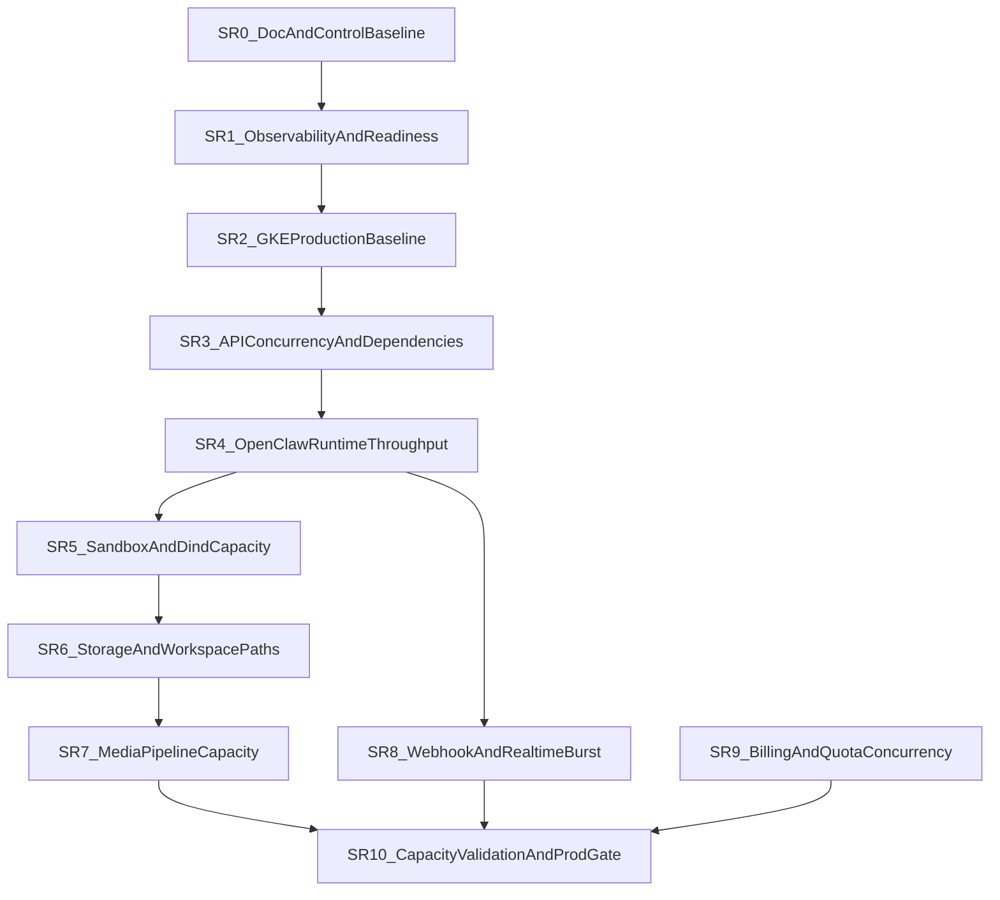

# SCALING-READINESS-PLAN

## Status
Working execution plan aligned with `ADR-070`.

## Resume Protocol
If a later Cursor session needs to recover context quickly, use this order:

1. `docs/SCALING-READINESS-PLAN.md`
2. `docs/ROADMAP.md`
3. `docs/SESSION-HANDOFF.md`
4. `docs/ADR/070-scaling-readiness-program-and-clean-delivery-discipline.md`
5. relevant supporting ADRs for the active slice

This file is the central execution plan for the scaling-readiness program.

## Purpose
Define one clean execution line for taking PersAI toward production-readiness for `1000–5000` online users without:

- losing context between Cursor-agent sessions
- mixing unrelated risk domains in one refactor
- deepening temporary compatibility paths
- stacking risky deploys without observation windows

## Program Principles
- PersAI remains the control plane; OpenClaw remains the execution plane.
- One session = one slice or one explicitly named sub-slice.
- Evidence first: confirmed bottlenecks, bounded hypotheses, explicit known risks.
- Clean delivery only: every temporary path must have a removal plan.
- No hidden parallel tracks: if a new concern appears, it becomes a named future slice or a new ADR-backed decision.

## Canonical Document Roles
- `ADR-070` = architecture, anti-scope rules, clean-delivery discipline
- `SCALING-READINESS-PLAN.md` = ordered slices, gates, handoff, current active slice
- `ROADMAP.md` = milestone visibility only
- `TEST-PLAN.md` = acceptance/load-test requirements only
- `SESSION-HANDOFF.md` = session progress only

## Cursor Agent Workflow
### Session entry protocol
Every agent starting or resuming a scaling slice must read:
1. this file
2. `docs/ROADMAP.md`
3. `docs/SESSION-HANDOFF.md`
4. `docs/ADR/070-scaling-readiness-program-and-clean-delivery-discipline.md`
5. supporting ADRs referenced by the active slice

### Parent vs subagent rule
- Only the parent agent updates canonical program docs.
- Subagents may gather evidence, but they do not become source-of-truth for slice state.

### Mandatory handoff fields
Each completed agent session must leave:
- active slice id
- what was completed
- what remains
- confirmed risks
- unresolved hypotheses
- metrics/tests still required
- next recommended step

## Clean Delivery Rules
### No-trash rule
Do not leave behind:
- indefinite compatibility paths
- duplicate old/new algorithms without a sunset plan
- stale rollout toggles with no owner and no removal condition
- forgotten scripts/checks that never became part of the operational baseline

### Clean replacement rule
Every slice must answer:
- what is being replaced
- what is being removed
- what remains as the deliberate baseline

### Hard stop rule
Do not start the next risky infra/runtime slice when the current one:
- failed smoke checks
- lacks observation-window evidence
- left unresolved regressions without owner
- left a temporary workaround without cleanup tracking

## Deploy And Verification Cadence
### Verification tiers
- `Tier 0` — static checks, lint, typecheck, contracts
- `Tier 1` — focused functional smoke
- `Tier 2` — deploy smoke in target environment
- `Tier 3` — observation window with metrics/log review
- `Tier 4` — targeted load/burst validation

### Default cadence
1. finish implementation for the active slice
2. run required Tier 0 / Tier 1 checks
3. deploy only the bounded affected surface
4. run Tier 2 smoke
5. wait through the required observation window
6. decide: close slice, rollback, or keep active

### Batching rule
Do not combine in one deploy window by default:
- GKE topology changes
- API concurrency semantics
- OpenClaw queue/sandbox changes
- storage/quota algorithm changes

## Active Program State
- `Current active slice`: `SR6` — Storage and workspace path hardening
- `Current active sub-slice`: `SR6e` — Known file-mutation quota cache delta accounting
- `Current phase`: Storage/workspace hardening
- `Next recommended slice after SR6`: `SR7` — Media pipeline capacity hardening
- `Last closed slice`: `SR5` — Sandbox and dind capacity hardening (closed 2026-04-06)
- `Post-SR5 baseline`: parallel sandbox image preload with retry, per-tier dind contention measured and documented, cross-pool isolation confirmed, predictable linear degradation under sandbox-heavy bursts

## Slice Template
Each slice must use this shape:
- `Outcome`
- `In scope`
- `Out of scope`
- `Primary files / domains`
- `Preconditions`
- `Do not touch`
- `Evidence required`
- `Verification`
- `Rollback / safe fallback`
- `Removal / cleanup obligations`
- `Deploy window`
- `Observation window`
- `Exit criteria`
- `Agent handoff checklist`

## Slice Dependency Graph

## Slice Plan
### SR0 — Documentation And Control Baseline
Outcome:
- one umbrella ADR for scaling-readiness
- one central execution plan
- roadmap and test-plan aligned to the program
- explicit Cursor-agent workflow and clean-delivery rules

In scope:
- docs only
- naming, slice order, handoff protocol, deploy/verification cadence

Out of scope:
- code or infra behavior changes
- performance tuning
- runtime logic changes

Primary files / domains:
- `docs/ADR/070-...`
- `docs/SCALING-READINESS-PLAN.md`
- `docs/ROADMAP.md`
- `docs/TEST-PLAN.md`
- `docs/CHANGELOG.md`
- `docs/SESSION-HANDOFF.md`

Evidence required:
- docs are internally consistent
- active slice and next slice are explicit

Verification:
- manual docs consistency review

Rollback / safe fallback:
- docs-only revert if needed

Removal / cleanup obligations:
- none

Deploy window:
- none

Observation window:
- none

Exit criteria:
- future Cursor sessions can resume the program from docs only

Agent handoff checklist:
- confirm current active slice
- confirm next slice
- confirm supporting ADR set

### SR1 — Platform Baseline And Observability
Outcome:
- operationally meaningful readiness, metrics, logging, alerting baseline

In scope:
- API readiness/metrics hardening
- OpenClaw observability baseline
- dependency metrics requirements
- alert and dashboard definitions

Out of scope:
- HPA / pool topology changes
- runtime queue semantics

Primary files / domains:
- `apps/api/src/modules/platform-core/interface/http/*`
- `infra/helm/templates/openclaw-configmap.yaml`
- observability-related docs and runbooks

Deploy window:
- API and runtime config only

Observation window:
- short for metrics-only config, extended if readiness semantics change

Exit criteria:
- Tier 0–3 evidence for health and metrics visibility

### SR2 — GKE Production Baseline
Outcome:
- replicas, requests/limits, rollout/disruption/autoscaling baseline

In scope:
- deployment strategy
- HPA/PDB/topology rules
- node/pool assumptions

Out of scope:
- application concurrency semantics

Primary files / domains:
- `infra/helm/values*.yaml`
- `infra/helm/templates/*deployment*.yaml`
- `infra/helm/templates/*service*.yaml`

Deploy window:
- infra only

Observation window:
- mandatory extended observation

Exit criteria:
- stable multi-replica rollout and restart behavior in target env

### SR3 — API Concurrency And Dependency Hardening
Outcome:
- API behaves predictably under burst and multi-replica operation

In scope:
- DB pool strategy
- webhook burst path
- stream timeout/backpressure
- distributed rate-limit correctness

Out of scope:
- OpenClaw queue semantics

Primary files / domains:
- API persistence services
- webhook proxy
- abuse/rate-limit services
- adapter timeout paths

Deploy window:
- API only

Observation window:
- mandatory

Exit criteria:
- no hidden single-process correctness assumptions left in API control plane

### SR4 — OpenClaw Runtime Throughput And Multi-Replica Correctness
Outcome:
- honest production runtime baseline for the current OpenClaw model, with explicit queue evidence and explicit non-support for multi-replica session execution

In scope:
- queue model
- `maxConcurrent`
- Redis spec-store behavior
- multi-replica correctness
- restart/session continuity evidence

Out of scope:
- dind economics redesign

Primary files / domains:
- OpenClaw queue/config/spec-store/runtime bridge

Deploy window:
- runtime pools only

Observation window:
- mandatory extended observation

Exit criteria:
- supported production runtime path is explicit (`single_replica`, one pod per runtime pool)
- multi-replica session execution is either proven or explicitly prohibited by contract
- first single-replica throughput ceiling is explicit and no longer hidden behind ambiguous runtime behavior

### SR5 — Sandbox And dind Capacity Hardening
Outcome:
- sandbox throughput and dind startup behavior are bounded and predictable

In scope:
- image preload
- startup latency
- dind contention
- per-tier sandbox concurrency caps
- bounded deploy-gap reduction for sandbox-capable runtime pools
- predictable degradation under sandbox-heavy bursts

Out of scope:
- storage algorithm redesign (SR6)
- multi-replica session ownership redesign
- changing Recreate strategy to RollingUpdate (requires session handoff)

Primary files / domains:
- runtime pool Helm
- sandbox runtime config
- relevant ADRs and runbooks

Deploy window:
- runtime pools only

Observation window:
- mandatory extended observation

Exit criteria:
- sandbox-heavy bursts degrade predictably and do not destabilize unrelated tiers

#### SR5a — Sandbox startup path optimization and readiness budget baseline

Outcome:
- sandbox-capable runtime pools reach readiness faster by parallelizing image preload and adding operational resilience to the preload path

In scope:
- parallel docker pull for base + common sandbox images (was sequential)
- bounded retry with configurable attempt count for pull failures (was immediate crash)
- timestamped progress logging at each preload phase for operational visibility
- configurable `preloadPullRetries` Helm value
- documented startup path timeline and readiness budget

Out of scope:
- per-tier sandbox concurrency caps (later SR5 sub-slice)
- dind contention under concurrent sandbox sessions (later SR5 sub-slice)
- dind sidecar probe addition (later SR5 sub-slice — requires measuring dind startup variance)
- startupProbe budget tightening (requires deploy-time measurement first)
- Recreate→RollingUpdate change (out of SR5 entirely — requires session handoff)

Primary files / domains:
- `infra/helm/templates/openclaw-deployment.yaml` — preload shell script
- `infra/helm/values.yaml` — `preloadPullRetries` default

Evidence required:
- Helm template renders cleanly for both `values.yaml` and `values-dev.yaml`
- `runtime-pools:readiness:strict` gate passes
- all three sandbox-capable pools render the parallel pull + retry script

Verification:
- `Tier 0`: `helm template` for both value files + `runtime-pools:readiness:strict`
- `Tier 2`: deploy to dev, observe preload logs for `[sandbox-preload]` progress markers, verify readiness time improvement
- `Tier 3`: observation window for pod restart behavior, image pull latency, retry behavior under transient GAR errors

Rollback / safe fallback:
- revert Helm template to sequential pulls (single-line change); `preloadPullRetries` is additive and non-breaking
- no runtime code changes, no OpenClaw source changes

Deploy window:
- runtime pools only (sandbox-capable deployments)

Observation window:
- one deploy cycle with fresh pod rollout per sandbox pool

Exit criteria:
- preload logs show parallel pull completion
- pod readiness time is measurably reduced compared to sequential baseline
- retry path does not mask permanent pull failures (still exits after max attempts)

#### SR5b — dind contention baseline and per-tier sandbox capacity evidence

Outcome:
- measured dind CPU contention behavior under 4 concurrent CPU-bound sandbox sessions per tier
- documented per-tier capacity ceiling as confirmed evidence, not hypothesis

In scope:
- controlled stress test (4× concurrent `python3 sum(i*i for i in range(10**8))`) on all three sandbox-capable pools
- per-tier dind CPU/RAM measurement under contention
- pod stability verification (readiness, restarts) under sustained sandbox load

Out of scope:
- changing dind CPU limits (requires cost/capacity decision, not SR5b)
- changing `maxConcurrent` queue cap (queue semantics, not dind contention)
- sandbox session GC/TTL tuning (later SR5 sub-slice if needed)

Evidence (measured 2026-04-06):

| Pool | dind CPU limit | dind CPU at 4× stress | dind RAM at 4× | Slowdown | Pod stable |
|---|---|---|---|---|---|
| `free_shared_restricted_sandbox` | 1000m (1 core) | **741-1000m** (saturated) | 267-372 MiB / 1280 MiB | ~4× | Yes, 0 restarts |
| `paid_shared_restricted_sandbox` | 1000m (1 core) | **1001m** (saturated) | 297-372 MiB / 2304 MiB | ~4× | Yes, 0 restarts |
| `paid_isolated` | 2000m (2 cores) | **2000m** (saturated) | 288-294 MiB / 4352 MiB | ~2× | Yes, 0 restarts |

Key findings:
- dind CPU is the binding constraint; RAM has 70-90% headroom on all tiers
- 4 concurrent CPU-bound sandbox exec saturates dind CPU on all tiers
- degradation is linear/predictable (proportional to core count), not crash/OOM
- pod readiness never lost during sustained saturation — gateway stays healthy
- `paid_isolated` (2 cores) completes ~2× faster than shared tiers (1 core) under same load
- `docker stats` CPU% inside rootless dind is unreliable for monitoring — use `kubectl top` or dind-internal `top`

Confirmed capacity per tier (4 concurrent CPU-bound sandbox exec):
- `free_shared_restricted`: 1 core shared → each session gets ~250m effective → severe slowdown
- `paid_shared_restricted`: 1 core shared → same ceiling as free
- `paid_isolated`: 2 cores → each session gets ~500m effective → moderate slowdown

Verification:
- `Tier 2`: controlled stress test on live dev cluster, all three pools
- `Tier 3`: pod readiness confirmed stable through full test duration

Exit criteria:
- per-tier sandbox CPU ceiling is measured and documented as confirmed evidence
- degradation behavior is linear, not catastrophic
- pod stability under sustained dind saturation is proven

#### SR5 closure evidence (2026-04-06)

SR5 exit criteria: "sandbox-heavy bursts degrade predictably and do not destabilize unrelated tiers"

Confirmed:
- sandbox-heavy bursts (4× concurrent CPU-bound exec) degrade linearly with core count, not catastrophically
- dind CPU is the binding constraint; RAM has 70-90% headroom
- pod readiness never lost during sustained saturation on any tier
- cross-pool isolation confirmed: stress on free pool does not affect paid pools (separate nodes, separate dind, separate cgroup limits)
- `docker stats` unreliable in rootless dind; `kubectl top` and dind-internal `top` are honest signals

Accepted known risks:
- dind CPU limits are product/cost decisions, not technical blockers — current limits may need adjustment for higher concurrency targets
- sandbox session GC/TTL not stress-tested (HOT_CONTAINER_WINDOW_MS = 5 min keeps idle containers alive)
- IO-bound sandbox workloads not tested (only CPU-bound)
- node co-location of multiple sandbox pools re-introduces bandwidth contention during image pulls (observed ~2.5 min extra)

### SR6 — Storage And Workspace Path Hardening
Outcome:
- storage path remains predictable under workspace/file churn

In scope:
- GCS FUSE pressure
- many-small-files behavior
- cleanup cost
- workspace quota enforcement filesystem cost
- session/transcript FS behavior

Out of scope:
- media business semantics changes
- media preprocessing/offload redesign (`SR7`)
- quota atomicity, billing sync, and commercial correctness under concurrency (`SR9`)

Primary files / domains:
- workspace cleanup and quota guards
- storage path docs and tests

Deploy window:
- runtime and possibly API depending on changes

Observation window:
- mandatory

Exit criteria:
- no major hidden FUSE/cleanup amplification left in the active path

#### SR6a — Workspace quota cache invalidation parity for filesystem mutations

Outcome:
- workspace quota cache no longer stays stale just because the agent frees or atomically replaces files through the sandbox filesystem bridge instead of the `exec` path

In scope:
- sandbox filesystem mutation paths that can change effective workspace usage without going through `writeFile`
- cache invalidation parity for `remove` / `rename`
- docs clarification that `SR6` owns filesystem cost of quota enforcement, not `SR9` commercial correctness

Out of scope:
- changing quota semantics, limits, or billing correctness rules
- replacing cached `du -sb` with a different accounting architecture
- media preprocessing temp-file throughput or offload work (`SR7`)

Primary files / domains:
- `openclaw/src/agents/sandbox/fs-bridge.ts`
- focused OpenClaw tests for filesystem mutation paths
- `docs/SCALING-READINESS-PLAN.md`
- `docs/TEST-PLAN.md`
- `docs/SESSION-HANDOFF.md`
- `docs/ADR/069-workspace-storage-quota-and-dind-privileged-removal.md`

Evidence required:
- `writeFile`, `remove`, and `rename` all keep workspace quota cache invalidation behavior aligned
- no new claim is made that quota correctness under concurrency is solved beyond this filesystem-cost seam

Verification:
- `Tier 0`: OpenClaw typecheck plus focused quota/fs-bridge tests

Rollback / safe fallback:
- revert the `fs-bridge.ts` mutation-cache invalidation change; no schema or API contract change

Removal / cleanup obligations:
- if a later `SR6` pass replaces cached `du` entirely, remove this parity-only note and document the new baseline

Deploy window:
- OpenClaw runtime only

Observation window:
- not closeable from this pass alone; later `SR6` passes still need live evidence for broader FUSE/churn behavior

Exit criteria:
- sandbox delete/rename paths no longer leave a hidden stale-cache tail after freeing or replacing workspace files

#### SR6b — Mid-exec workspace quota watch for large-write bursts

Outcome:
- a single long-running `exec` command can no longer keep filling the workspace unchecked until exit; quota breach is detected during the run and the process is terminated

In scope:
- foreground `exec` path quota monitoring while the child process is still running
- bounded kill path when workspace usage crosses the configured limit mid-command
- docs correction for prior over-strong claims that the burst window was already closed

Out of scope:
- replacing cached `du -sb` with final incremental accounting
- quota correctness under concurrency or billing semantics (`SR9`)
- media preprocessing temp-file redesign (`SR7`)
- broader session/transcript churn closure for all `SR6`

Primary files / domains:
- `openclaw/src/agents/bash-tools.exec.ts`
- focused OpenClaw quota-watch tests
- `docs/ADR/069-workspace-storage-quota-and-dind-privileged-removal.md`
- `docs/TEST-PLAN.md`
- `docs/SESSION-HANDOFF.md`
- `docs/CHANGELOG.md`

Evidence required:
- a running non-cleanup `exec` is terminated when periodic quota checks observe the workspace over limit
- cleanup commands still bypass the kill path so over-quota remediation remains possible
- docs no longer claim the large-write burst window is fully closed beyond the evidence of this pass

Verification:
- `Tier 0`: OpenClaw typecheck plus focused quota-watch tests
- `Tier 2`: live repro using an oversized single-command write must stop near the quota boundary instead of reaching multi-GB growth

Rollback / safe fallback:
- revert the quota-watch loop in `bash-tools.exec.ts`; fall back to pre/post checks only

Removal / cleanup obligations:
- if a later `SR6` pass replaces periodic `du` polling with a different enforcement architecture, remove this stop-gap note and document the new active baseline

Deploy window:
- OpenClaw runtime only

Observation window:
- required; this pass is still not sufficient to close all of `SR6`

Exit criteria:
- a single foreground `exec` can no longer silently grow the workspace far past quota before the command exits

#### SR6c — Workspace quota measurement fail-safe semantics

Outcome:
- quota enforcement no longer silently weakens to "0 bytes used" just because `du -sb` failed or returned malformed output

In scope:
- `workspace-quota-guard.ts` measurement failure behavior
- fail-safe semantics for `exec` and sandbox `writeFile` when workspace usage cannot be measured
- docs correction so quota enforcement claims match the real guarded behavior

Out of scope:
- replacing `du -sb` with final incremental accounting
- transcript/session filesystem churn closure
- quota correctness under concurrency or billing semantics (`SR9`)
- media preprocessing/offload redesign (`SR7`)

Primary files / domains:
- `openclaw/src/agents/workspace-quota-guard.ts`
- `openclaw/src/agents/bash-tools.exec.ts`
- `openclaw/src/agents/sandbox/fs-bridge.ts`
- focused OpenClaw quota guard tests
- `docs/ADR/069-workspace-storage-quota-and-dind-privileged-removal.md`
- `docs/TEST-PLAN.md`
- `docs/SESSION-HANDOFF.md`
- `docs/CHANGELOG.md`

Evidence required:
- quota checks fail safe when measurement is unavailable or malformed
- non-cleanup `exec` does not continue under an unverified quota state
- sandbox `writeFile` does not proceed when quota cannot be measured

Verification:
- `Tier 0`: OpenClaw typecheck plus focused quota guard / exec / fs-bridge tests

Rollback / safe fallback:
- revert the measurement-failure handling and fall back to the prior permissive behavior

Removal / cleanup obligations:
- if a later `SR6` pass replaces `du -sb` entirely, remove this fail-safe note and document the new measurement contract

Deploy window:
- OpenClaw runtime only

Observation window:
- required; this still does not close all of `SR6`

Exit criteria:
- quota measurement failure no longer degrades into fail-open workspace growth on the active guarded paths

#### SR6d — First-poll quota watch tightening for fast oversized writes

Outcome:
- a single foreground `exec` can no longer evade the mid-exec quota watch just by finishing before the first scheduled quota sample

In scope:
- the first quota-watch scheduling window after `exec` spawn
- focused docs correction after live evidence showed a `700 MB` quota session still allowed one `800 MB` single-command write to finish and only blocked later commands
- focused regression coverage for the pre-fix blind window

Out of scope:
- replacing cached `du -sb` with final incremental accounting
- quota correctness under concurrency or billing semantics (`SR9`)
- media preprocessing temp-file redesign (`SR7`)
- broader session/transcript churn closure for all `SR6`

Primary files / domains:
- `openclaw/src/agents/bash-tools.exec.ts`
- focused OpenClaw quota-watch tests
- `docs/ADR/069-workspace-storage-quota-and-dind-privileged-removal.md`
- `docs/TEST-PLAN.md`
- `docs/SESSION-HANDOFF.md`
- `docs/CHANGELOG.md`

Evidence required:
- the first mid-exec quota sample happens early enough that a fast oversized single-command write does not rely only on post-command blocking
- focused tests cover the old "finishes before first poll" blind window
- docs no longer imply the deployed `SR6b` stop-gap already closed this fast-write gap before live proof

Verification:
- `Tier 0`: OpenClaw typecheck plus focused quota-watch tests
- `Tier 2`: rerun the single-command oversized write repro and confirm the same command is terminated by the quota watch instead of succeeding and only blocking follow-up commands

Rollback / safe fallback:
- revert the first-poll tightening in `bash-tools.exec.ts`; fall back to the slower `SR6b` polling-only stop-gap

Removal / cleanup obligations:
- if a later `SR6` pass replaces periodic `du` polling with a different enforcement architecture, remove this stop-gap note and document the new active baseline

Deploy window:
- OpenClaw runtime only

Observation window:
- required; this still does not close all of `SR6`

Exit criteria:
- a single foreground `exec` can no longer avoid mid-exec enforcement purely because it finishes before the first scheduled quota-watch sample

#### SR6e — Known file-mutation quota cache delta accounting

Outcome:
- known file mutations no longer force a full workspace re-measure on the next guarded operation when the runtime already knows the exact byte delta

In scope:
- quota-cache updates for known file mutations on sandbox `writeFile`, file `remove`, and file-overwrite `rename`
- reducing avoidable `du -sb` pressure on active file-mutation paths without changing quota semantics
- truthful docs update after `SR6d` live evidence showed the remaining tail had shifted from burst correctness to storage-cost amplification

Out of scope:
- replacing cached `du -sb` with final incremental accounting for all paths
- recursive directory-delete accounting beyond safe fallback invalidation
- quota correctness under concurrency or billing semantics (`SR9`)
- media preprocessing temp-file redesign (`SR7`)
- broader session/transcript cleanup redesign

Primary files / domains:
- `openclaw/src/agents/workspace-quota-guard.ts`
- `openclaw/src/agents/sandbox/fs-bridge.ts`
- focused OpenClaw quota / fs-bridge tests
- `docs/SCALING-READINESS-PLAN.md`
- `docs/TEST-PLAN.md`
- `docs/SESSION-HANDOFF.md`
- `docs/CHANGELOG.md`

Evidence required:
- file overwrite/delete/overwrite-rename paths update the cached workspace usage using known byte deltas instead of always forcing the next guarded read back to `du -sb`
- recursive or directory-shaped mutations still fail safe through cache invalidation
- docs no longer overstate `SR6` as already fully closed while this cost-reduction pass is still in flight

Verification:
- `Tier 0`: OpenClaw typecheck plus focused quota / fs-bridge tests
- `Tier 2`: after deploy, rerun one representative workspace-mutation-heavy flow and confirm the remaining `SR6` decision is now about accepted residual risks rather than a still-open hidden mutation-cost tail

Rollback / safe fallback:
- revert the `fs-bridge` cache-delta accounting and fall back to invalidation-only behavior

Removal / cleanup obligations:
- if a later `SR6` or post-`SR6` pass replaces cached `du -sb` entirely, remove this delta-accounting stop-gap and document the new baseline

Deploy window:
- OpenClaw runtime only

Observation window:
- required before calling all of `SR6` closed

Exit criteria:
- known file-mutation paths no longer create an avoidable full-workspace re-measure tail on the next guarded operation

### SR7 — Media Pipeline Capacity Hardening
Outcome:
- media path no longer dominates API/runtime under burst

In scope:
- concurrent uploads
- STT/TTS/image/pdf preprocessing
- temp-file lifecycle
- worker/offload decision

Out of scope:
- provider-routing redesign

Primary files / domains:
- media preprocessor and media services

Deploy window:
- API and affected runtime/media config

Observation window:
- mandatory

Exit criteria:
- media bursts are bounded and visible operationally

### SR8 — Webhook And Realtime Burst Hardening
Outcome:
- Telegram/web stream/internal callback fan-in survives burst predictably

In scope:
- Telegram fan-in
- web stream resilience
- retry/idempotency
- controlled overload

Out of scope:
- quota accounting redesign

Primary files / domains:
- webhook proxy
- stream transport
- realtime retry/idempotency paths

Deploy window:
- API and relevant routing/runtime ingress

Observation window:
- mandatory

Exit criteria:
- burst behavior is measured and bounded

### SR9 — Billing And Quota Correctness Under Concurrency
Outcome:
- quota, billing, and plan changes remain predictable under concurrency

In scope:
- quota atomicity
- race-safe enforcement
- plan propagation
- real billing sync assumptions

Out of scope:
- unrelated UX changes

Primary files / domains:
- quota tracking
- subscription resolution
- enforcement points

Deploy window:
- API only

Observation window:
- mandatory

Exit criteria:
- concurrent usage cannot silently violate commercial boundaries in common paths

### SR10 — Capacity Validation And Production Gate
Outcome:
- explicit go/no-go gates for `1000`, `3000`, `5000`

In scope:
- load-test matrix
- SLO thresholds
- capacity budgets
- known-risk register

Out of scope:
- new architecture changes unless validation disproves assumptions

Primary files / domains:
- `docs/TEST-PLAN.md`
- runtime/load-test docs
- runbooks

Deploy window:
- none by default; validation and controlled experiments

Observation window:
- required by definition

Exit criteria:
- documented capacity envelope with evidence for each target tier
